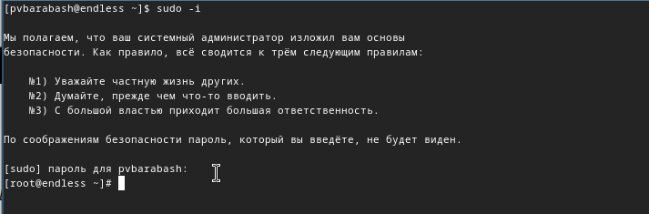
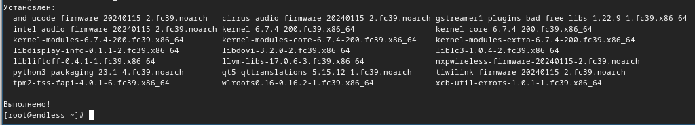
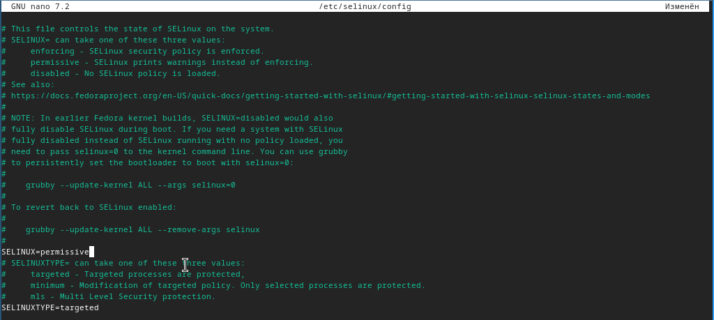
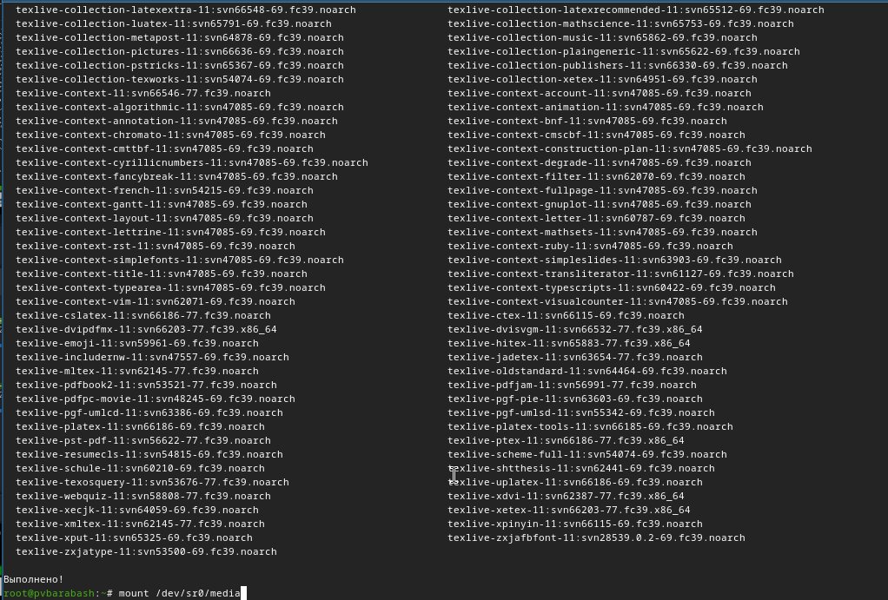

---
## Front matter
title: "Отчёт по лабораторной работе"
subtitle: "Лабораторная №1"
author: "Полина Витальевна Барабаш"

## Generic otions
lang: ru-RU
toc-title: "Содержание"

## Pdf output format
toc: true # Table of contents
toc-depth: 2
lof: true # List of figures
fontsize: 12pt
linestretch: 1.5
papersize: a4
documentclass: scrreprt
## I18n polyglossia
polyglossia-lang:
  name: russian
  options:
	- spelling=modern
	- babelshorthands=true
polyglossia-otherlangs:
  name: english
## I18n babel
babel-lang: russian
babel-otherlangs: english
## Fonts
mainfont: PT Serif
romanfont: PT Serif
sansfont: PT Sans
monofont: PT Mono
mainfontoptions: Ligatures=TeX
romanfontoptions: Ligatures=TeX
sansfontoptions: Ligatures=TeX,Scale=MatchLowercase
monofontoptions: Scale=MatchLowercase,Scale=0.9
## Biblatex
biblatex: true
biblio-style: "gost-numeric"
biblatexoptions:
  - parentracker=true
  - backend=biber
  - hyperref=auto
  - language=auto
  - autolang=other*
  - citestyle=gost-numeric
## Pandoc-crossref LaTeX customization
figureTitle: "Рис."
listingTitle: "Листинг"
lofTitle: "Список иллюстраций"
lolTitle: "Листинги"
## Misc options
indent: true
header-includes:
  - \usepackage{indentfirst}
  - \usepackage{float} # keep figures where there are in the text
  - \floatplacement{figure}{H} # keep figures where there are in the text
---
# Цель работы

Целью данной работы является приобретение практических навыков установки операционной системы на виртуальную машину, настройки минимально необходимых для дальнейшей работы сервисов.

# Задание
Установить операционную систему на виртуальную машину и настроить минимально необходимые для дальнейшей работы сервисы. 

# Выполнение лабораторной работы

Задание 1. Запустите терминал. Перейдите в каталог /var/tmp. Создайте каталог с именем пользователя (совпадающий с логином студента в дисплейном классе). Проверьте в свойствах VirtualBox месторасположение каталога для виртуальных машин. Перенесите установочный образ в папку /var/tmp/имя_пользователя/iso.

Я запустила терминал и перешла в каталог /var/tmp с помощью команды cd и с помощью mkdir я создала в этом каталоге каталог с именем пользователя, совпадающий с логином в дисплейном классе, то есть был создан каталог pvbarabash  (рис. [-@fig:001]).

{#fig:001 width=70%}

Я проверила в свойствах VirtualBox месторасположение каталога для виртуальных машин. Так как папкой для машин по умолчанию была домашняя папка, я изменила её на созданный ранее каталог /var/tmp/pvbarabash (рис. [-@fig:002]).

{#fig:002 width=70%}

Я создала папку /var/tmp/pvbarabash/iso с помощью команды. Затем я перешла в каталог Загрузки и переместила устнановочный образ в созданную папку с помощью команды (рис. [-@fig:003]).

{#fig:003 width=70%}

Задание 2. Настройте хост-клавиши.

Хост-клавишей по умолчанию является правый Ctrl. По умолчанию в дисплейных классах на клавише правый Ctrl находится переключатель языка ввода. Эти значения могут конфликтовать. Поэтому требуется изменить хост-клавишу. Я изменила её на правый alt в графическом интерфейсе (рис. [-@fig:004]).

{#fig:004 width=70%}

Задание 3. Для использования графического интерфейса запустите менеджер виртуальных машин. Создайте новую виртуальную машину в графическом интерфейсе или в командной строке. Укажите имя виртуальной машины (ваш логин в дисплейном классе), тип операционной системы — Linux, Fedora. Укажите размер основной памяти виртуальной машины — от 2048 МБ. Задайте конфигурацию жёсткого диска — загрузочный, VDI (VirtualBox Disk Image), динамический виртуальный диск. Задайте размер диска — 80 ГБ (или больше), его расположение — в данном случае /var/tmp/имя_пользователя/имя_машины/имя_машины.vdi. Добавьте новый привод оптических дисков и выберите образ. В качестве графического контроллера поставьте VMSVGA. Включите ускорение 3D. Включите общий буфер обмена и перетаскивание объектов между хостом и гостевой ОС. Включите поддержку UEFI.

Я запустила менеджер виртуальных машин с помощью VirtualBox & (рис. [-@fig:005]).

{#fig:005 width=70%}

Я создала новую виртуальную машину в графическом интерфейсе, указала имя виртуальной машины — мой логин в дисплейном классе, тип операционной системы — Linux, Fedora. Я указала размер основной памяти виртуальной машины — 2048 МБ, задала конфигурацию жёсткого диска — загрузочный, VDI (VirtualBox Disk Image), динамический виртуальный диск. Также я задала размер диска — 80 ГБ, его расположение — в данном случае /var/tmp/pvbarabash/pvbarabash/pvbarabash.vdi. Я добавила новый привод оптических дисков и выберала образ. В качестве графического контроллера поставила VMSVGA (рис. [-@fig:006]).

{#fig:006 width=70%}

В настройках машины я включила ускорение 3D (рис. [-@fig:007]).
{#fig:007 width=70%}

Я включила общий буфер обмена и перетаскивание объектов между хостом и гостевой ОС (рис. [-@fig:008]).

{#fig:008 width=70%}

Я включила поддержку UEFI (рис. [-@fig:009]).

{#fig:009 width=70%}

Задание 4. Загрузите LiveCD. Создайте конфигурацию по умолчанию. Нажмите Enter, чтобы выбрать в качестве модификатора клавишу Win (она же клавиша Super). Нажмите комбинацию Win+Enter для запуска терминала. В терминале запустите liveinst.

Я загрузила LiveCD. Появился интерфейс начальной конфигурации (рис. [-@fig:010]).

{#fig:010 width=70%}

С помощью Enter я создала конфигурацию по умолчанию, выбрала в качестве модификатора клавишу Win. Нажала комбинацию Win+Enter для запуска терминала. В терминале запустила liveinst (рис. [-@fig:011]).

{#fig:011 width=70%}

Задание 5. Выберите язык интерфейса и перейдите к настройкам установки операционной системы. Место установки ОС оставьте без изменения. Установите имя и пароль для пользователя root. Установите имя и пароль для Вашего пользователя. Задайте сетевое имя Вашего компьютера. После завершения установки операционной системы корректно перезапустите виртуальную машину. В VirtualBox оптический диск должен отключиться автоматически, но если это не произошло, то необходимо отключить носитель информации с образом.

Я выбрала язык интерфейса (русский язык) и перешла к настройкам установки операционной системы. Место установки ОС оставила без изменения. Установила имя и пароль для пользователя root, имя и пароль для своего пользователя. Задала сетевое имя своего компьютера. После завершения установки операционной системы корректно перезапустила виртуальную машину. Я отключила носитель информации с образом. Система установилась (рис. [-@fig:012]).

{#fig:012 width=70%}

Задание 6. Войдите в ОС под заданной вами при установке учётной записью. Нажмите комбинацию Win+Enter для запуска терминала. Переключитесь на роль супер-пользователя.

Я вошла в ОС под заданной вами при установке учётной записью. Нажала комбинацию Win+Enter для запуска терминала. Переключилась на роль супер-пользователя с помощью команды sudo -i (рис. [-@fig:013]).

{#fig:013 width=70%}

Задание 7. Обновить все пакеты. Повысить комфорт работы. Поставить автоматическое обновление.

Я обновила все пакеты с помощью команды dnf -y update (рис. [-@fig:014]).

{#fig:014 width=70%}

Я повысила комфорт работы, установив программу tmux mc с помощью команды dnf -y install tmux mc (рис. [-@fig:015]).

{#fig:015 width=70%}

Я поставила автоматическое обновление: установила программное обеспечение с помощью dnf install dnf-automatic (рис. [-@fig:016]).

{#fig:016 width=70%}

Я запустила таймер (рис. [-@fig:017]).

{#fig:017 width=70%}

Задание 8. Отключить SELinux.

Я отключила SELinux. Для этого я открыла файл /etc/selinux/config с помощью nano и изменила SELINUX=enforcing на значение SELINUX=permissive (рис. [-@fig:018]).

{#fig:018 width=70%}

Я перезагрузила виртуальную машину с помощью reboot.

Задание 9. Установить драйвера для VirtualBox.

В терминале я запустила tmux, переключилась в режим супер-пользователя, установила средства разработки с помощью команды dnf -y group install "Development Tools" (рис. [-@fig:019]).

{#fig:019 width=70%}

Я установила пакет DKMS с помощью dnf -y install dkms (рис. [-@fig:020]).

{#fig:020 width=70%}

В меню виртуальной машины я подключила образ диска дополнений гостевой ОС. Затем подмонтировала диск с помощью mount /dev/sr0 /media (рис. [-@fig:021]).

{#fig:021 width=70%}

Я установила драйвера с помощью /media/VBoxLinuxAdditions.run (рис. [-@fig:022]).

{#fig:022 width=70%}

Я перегрузила виртуальную машину с помощью reboot.

Задание 10. Настроить раскладку клавиатуры.

Я вошла в ОС, перешла в терминал и запустила tmux. Затем я создала конфигурационный файл ~/.config/sway/config.d/95-system-keyboard-config.conf с помощью команды touch (рис. [-@fig:023]).

{#fig:023 width=70%}

Из режима супер-пользователя я отредактировала созданный конфигурационный файл с помощью nano (рис. [-@fig:024]).

{#fig:024 width=70%}

Я перезагрузила виртуальную машину.

Задание 11. Изменение имени хоста.

С помощью команды hostnamectl set-hostname pvbarabash я изменила имя хоста на pvbarabash, так как изначально не поняла, что имя хоста должно также быть идентифицируемым. Я проверила имя хоста с помощью команды hostnamectl (рис. [-@fig:025]).

{#fig:025 width=70%}

Задание 12. Подключить общую папку. 

Внутри виртуальной машины я добавила своего пользователя в группу vboxsf с помощью gpasswd -a pvbarabash vboxsf (рис. [-@fig:026]).

{#fig:026 width=70%}

В хостовой системе я подключила разделяемую папку (рис. [-@fig:027]).

{#fig:027 width=70%}

Я перезагрузила виртуальную машину.

Задание 13. Установить pandoc и texlive.

В режиме супер-пользователя я установила pandoc с помощью команды dnf -y install pandoc (рис. [-@fig:028]).

{#fig:028 width=70%}

Так как пакет pandoc-crossref в стандартном репозитории отсутствует, я скачала соответствующую версию pandoc-crossref и поместила её в каталог /usr/local/bin.

Я установила дистрибутив texlive с помощью команды dnf -y install texlive-scheme-full (рис. [-@fig:029]).

{#fig:029 width=70%}

# Домашнее задание

Задание 1. Получите следующую информацию.

    Версия ядра Linux (Linux version).
    Частота процессора (Detected Mhz processor).
    Модель процессора (CPU0).
    Объём доступной оперативной памяти (Memory available).
    Тип обнаруженного гипервизора (Hypervisor detected).
    Тип файловой системы корневого раздела.
    Последовательность монтирования файловых систем.

С помощью команды dmesg | grep -i "то, что ищем" я нашла всю необходимую информацию. Она представлена на скриншотах (рис. [-@fig:030] —  рис. [-@fig:035]).

{#fig:030 width=70%}

{#fig:031 width=70%}

{#fig:032 width=70%}

{#fig:033 width=70%}

{#fig:034 width=70%}

{#fig:035 width=70%}

# Ответы на вопросы

1. Какую информацию содержит учётная запись пользователя?

Системное имя, идентификатор пользователя, идентификатор группы, полное имя, домашний каталог, командная оболочка.

2. Укажите команды терминала и приведите примеры.

Для получения справки по команде используется команда man, например, чтобы посмотреть руководство по команде man нужно ввести команду man man.

Для перемещения по файловой системе используется команда cd, например, чтобы перейти в каталог Загрузки, нужно ввести команду cd home/Загрузки.

Для просмотра содержимого каталога используется команда ls, например, чтобы посмотреть содержание каталога Загрузки, нужно ввести команду ls home/Загрузки.

Для определения объёма каталога используется команда du, например, чтобы посмотреть объём каталога Загрузки, нужно ввести команду du home/Загрузки.

Для создания каталогов используется команда mkdir (например, при использовании команды mkdir home/pvbarabash будет создан каталог pvbarabash), для удаления пустого каталога используется команда rmdir (например, rmdir pvbarabash), если каталог не пустой, то система выдаст ошибку. Для удаления каталога с файлами необходимо использовать команду rm -R, которая рекурсивно удаляет всё содержимое (например, rm -R pvbarabash).

Для создания файлов используется команда touch, например touch text.txt. Для удаления используется команда rm, например rm text.txt.

Для задания определённых прав на файл/каталог используется команда chmod, например 750 text.txt.

Для просмотра истории команд используется команда history, например, чтобы посмотреть историю команд для терминала запускается просто команда history.

3. Что такое файловая система? Приведите примеры с краткой характеристикой.

Файловая система — это структура, используемая операционной системой для организации и управления файлами на устройстве хранения, например на жестком диске, твердотельном накопителе (SSD) или USB-накопителе.

4. Как посмотреть, какие файловые системы подмонтированы в ОС?

Для просмотра подмонтированных файловых систем используется команда findmnt.

5. Как удалить зависший процесс?
Чтобы удалить зависший процесс, нужно нажать клавиши Alt+F4 или Alt+Fn+F4.

# Выводы

При выполнении данной лабораторной работы я приобрела практические навыки установки операционной системы на виртуальную машину и настройки минимально необходимых для дальнейшей работы сервисов.
