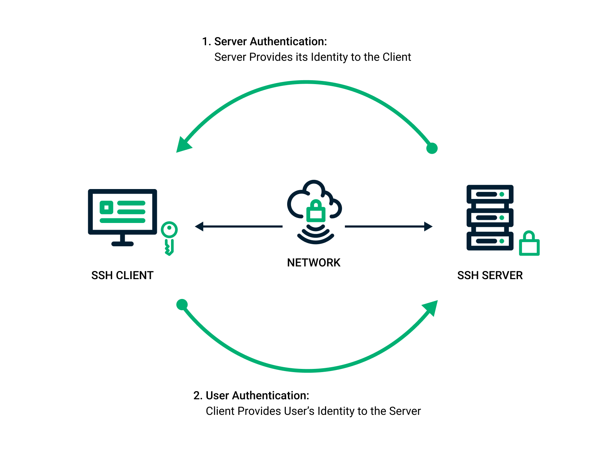

---
## Front matter
lang: ru-RU
title: Презентация лабораторной работы
subtitle: Лабораторная №2
author:
  - Барабаш П. В.
institute:
  - Российский университет дружбы народов, Москва, Россия
date: 02 марта 2024

## i18n babel
babel-lang: russian
babel-otherlangs: english

## Formatting pdf
toc: false
toc-title: Содержание
slide_level: 2
aspectratio: 169
section-titles: true
theme: metropolis
header-includes:
 - \metroset{progressbar=frametitle,sectionpage=progressbar,numbering=fraction}
 - '\makeatletter'
 - '\beamer@ignorenonframefalse'
 - '\makeatother'
 
 
## Fonts
mainfont: PT Serif
romanfont: PT Serif
sansfont: PT Sans
monofont: PT Mono
mainfontoptions: Ligatures=TeX
romanfontoptions: Ligatures=TeX
sansfontoptions: Ligatures=TeX,Scale=MatchLowercase
monofontoptions: Scale=MatchLowercase,Scale=0.9

---

## Докладчик

:::::::::::::: {.columns align=center}
::: {.column width="70%"}

  * Барабаш Полина Витальевна
  * студентка 1 курса, НПИбд-01-23
  * Российский университет дружбы народов
  * [1132231841@pfur.ru](mailto:1132231841@pfur.ru)

:::
::: {.column width="30%"}

:::
::::::::::::::

## Цели и задачи

Цель: изучить идеологию и применение средств контроля версий и освоить умения по работе с git

Задачи:

- Создать базовую конфигурацию для работы с git
- Создать необходимые ключи (SSH и PGP)
- Настроить подписи git
- Создать локальный каталог для выполнения заданий по предмету

## Система контроля версий git

# Анализ и результаты выполнения лабораторной работы

## Базовая настройка git

## Ключи ssh

## Ключи PGP

## Настройка автоматических подписей коммитов git

## Создание репозитория курса на основе шаблона

## Отправка файлов на сервер

## Выводы

