---
## Front matter
title: "Отчёт по лабораторной работе"
subtitle: "Лабораторная №2"
author: "Полина Витальевна Барабаш"

## Generic otions
lang: ru-RU
toc-title: "Содержание"

## Pdf output format
toc: true # Table of contents
toc-depth: 2
lof: true # List of figures
fontsize: 12pt
linestretch: 1.5
papersize: a4
documentclass: scrreprt
## I18n polyglossia
polyglossia-lang:
  name: russian
  options:
	- spelling=modern
	- babelshorthands=true
polyglossia-otherlangs:
  name: english
## I18n babel
babel-lang: russian
babel-otherlangs: english
## Fonts
mainfont: PT Serif
romanfont: PT Serif
sansfont: PT Sans
monofont: PT Mono
mainfontoptions: Ligatures=TeX
romanfontoptions: Ligatures=TeX
sansfontoptions: Ligatures=TeX,Scale=MatchLowercase
monofontoptions: Scale=MatchLowercase,Scale=0.9
## Biblatex
biblatex: true
biblio-style: "gost-numeric"
biblatexoptions:
  - parentracker=true
  - backend=biber
  - hyperref=auto
  - language=auto
  - autolang=other*
  - citestyle=gost-numeric
## Pandoc-crossref LaTeX customization
figureTitle: "Рис."
listingTitle: "Листинг"
lofTitle: "Список иллюстраций"
lolTitle: "Листинги"
## Misc options
indent: true
header-includes:
  - \usepackage{indentfirst}
  - \usepackage{float} # keep figures where there are in the text
  - \floatplacement{figure}{H} # keep figures where there are in the text
---
# Цель работы

Целью данной работы является изучить идеологию и применение средств контроля версий и освоить умения по работе с git.

# Задание

Создать базовую конфигурацию для работы с git.
Создать ключ SSH.
Создать ключ PGP.
Настроить подписи git.
Зарегистрироваться на Github.
Создать локальный каталог для выполнения заданий по предмету.

# Выполнение лабораторной работы

Задание 1. Установить git.

Я вошла в режим суперпользователя и установила git с помощью команды dnf install git (рис. [-@fig:001]).

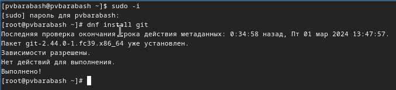{#fig:001 width=70%}

Задание 2. Установить gh.

Я установила gn с помощью команды dnf install gh (рис. [-@fig:002]).

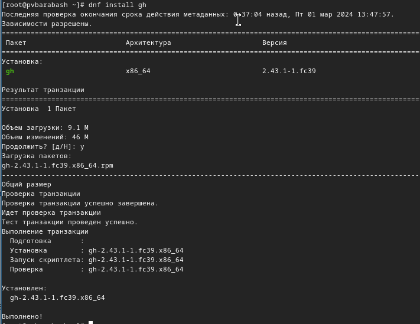{#fig:002 width=70%}

Задание 3. Произвести базовую настройку git. Задать имя и email владельца репозитория. Настроить utf-8 в выводе сообщений git. Задать имя начальной ветки, параметр autocrlf, параметр safecrlf.

Я задала имя и email своего репозитория с помощью двух команд:
 
git config --global user.name "Name Surname"

git config --global user.email "work@mail" 

Вместо Name Surname я ввела имя своего репозитория и вместо work@mail почту, на которую зарегистрирована учетная запись (рис. [-@fig:003]).

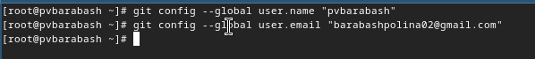{#fig:003 width=70%}

Я настроила utf-8 в выводе сообщений git с помощью команды git config --global core.quotepath false, задала имя начальной ветки master с помощью команды git config --global init.defaultBranch master, параметр autocrlf с помощью git config --global core.autocrlf input и параметр safecrlf с помощью git config --global core.safecrlf warn (рис. [-@fig:004]).

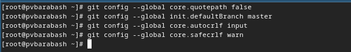{#fig:004 width=70%}

 
Задание 3. Создать ключи ssh по двум алгоритмам. 

Я создала ключ ssh по алгоритму rsa с ключём размером 4096 бит с помощью команды ssh-keygen -t rsa -b 4096  (рис. [-@fig:005]).

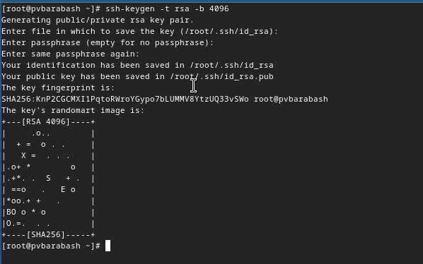{#fig:005 width=70%}

Я создала ключ по алгоритму ed25519 с помощью команды ssh-keygen -t ed25519 (рис. [-@fig:006]).

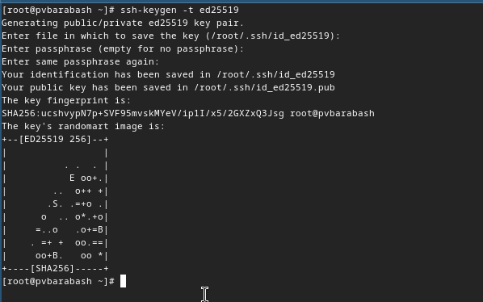{#fig:006 width=70%}

Задание 4. Создать ключи PGP.

Я Сгенерировала ключ PGP с помощью команды gpg --full-generate-key. Из предложенных опций выбирала:

тип RSA and RSA;

размер 4096;

срок действия 0 (срок действия не истекает никогда).

Я ввела личную информацию, которая сохранится в ключе: имя и адрес электронной почты (рис. [-@fig:007]).

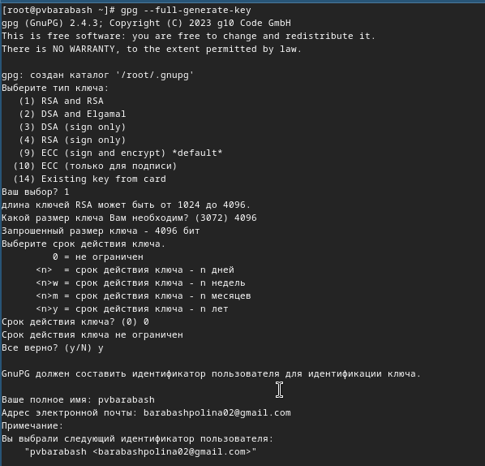{#fig:007 width=70%}

Задание 5. Добавить PGP ключ в GitHub.

Я вывела список ключей и скопировала отпечаток приватного ключа с помощью gpg --list-secret-keys --keyid-format LONG. Он начинается после после sec (рис. [-@fig:008]).

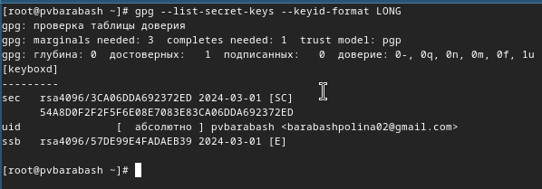{#fig:008 width=70%}

Для копирования ключа у меня была ошибка с xclip, поэтому я вывела ключ с помощью команды gpg --armor --export <PGP Fingerprint> и скопировала его вручную (рис. [-@fig:009]).

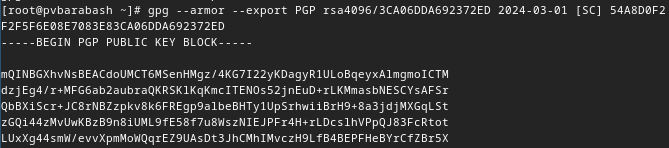{#fig:009 width=70%}

Я перешла в настройки GitHub, нажала на кнопку New GPG key и вставила полученный ключ в поле ввода (рис. [-@fig:010]).

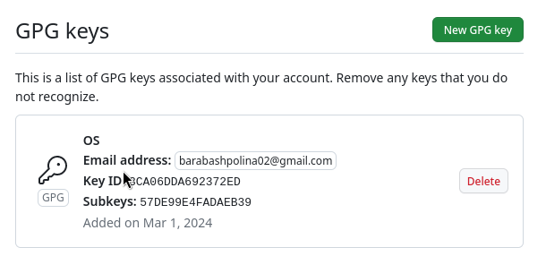{#fig:010 width=70%}

Задание 6. Используя введёный email, указать Git применять его при подписи коммитов

Я указала Git применять email при подписи коммитов с помощью следующих команд:

git config --global user.signingkey <PGP Fingerprint>

git config --global commit.gpgsign true

git config --global gpg.program $(which gpg2) (рис. [-@fig:011]).

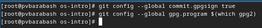{#fig:011 width=70%}

Задание 7. Настроить gh.

Сначала я авторизовалась с помощью команды gh auth login и ответила на наводящие вопросы, а затем авторизовалась через браузер (рис. [-@fig:012]).

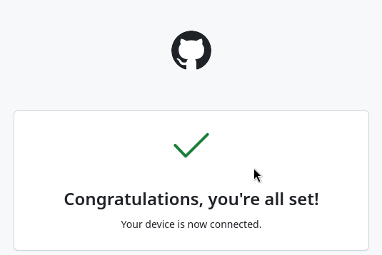{#fig:012 width=70%}

Задание 8. Создать шаблон рабочего пространства.

Я создала нужный каталог с помощью команды mkdir -p ~/work/study/2022-2023/"Операционные системы". Перешла в него с помощью команды cd. Так как на github у меня уже был скопирован шаблон рабочего пространства, я клонировала его с помощью команды git clone --recursive git@github.com:<owner>/study_2022-2023_os-intro.git os-intro (рис. [-@fig:013]).

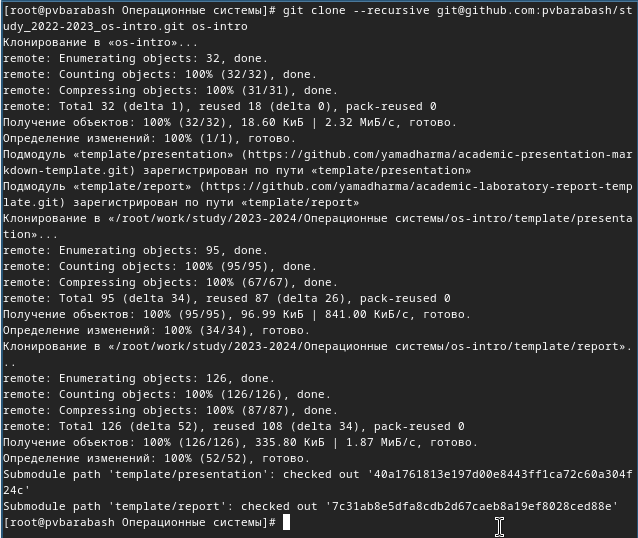{#fig:013 width=70%}

Задание 9. Настроить каталог курса.

Я перешла в каталог курса с помощью команды cd ~/work/study/2022-2023/"Операционные системы"/os-intro и удалила лишние файлы с помощью команды rm package.json (рис. [-@fig:014]).

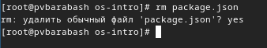{#fig:014 width=70%}

Я создала необходимые каталоги с помощью команд echo os-intro > COURSE и make (рис. [-@fig:015]).

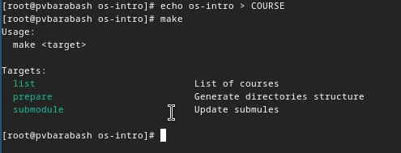{#fig:015 width=70%}

Затем я отправила файлы на сервер (рис. [-@fig:016]).

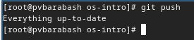{#fig:016 width=70%}

# Ответы на вопросы

1. Что такое системы контроля версий (VCS) и для решения каких задач они предназначаются?
Система контроля версий это — программное обеспечение для облегчения работы с изменяющейся информацией. Системы контроля версий (Version Control System, VCS) применяются при работе нескольких человек над одним проектом. 

2. Объясните следующие понятия VCS и их отношения: хранилище, commit, история, рабочая копия.

В классических системах контроля версий используется централизованная модель, предполагающая наличие единого репозитория для хранения файлов. Выполнение большинства функций по управлению версиями осуществляется специальным сервером. Участник проекта (пользователь) перед началом работы посредством определённых команд получает нужную ему версию файлов. После внесения изменений, пользователь размещает новую версию в хранилище. Также он может добавлять коммиты — комментарии о том, что было изменено. Пользователь создает рабочаю копию. При этом предыдущие версии не удаляются из центрального хранилища и к ним можно вернуться в любой момент — система хранит историю версий. 

3. Что представляют собой и чем отличаются централизованные и децентрализованные VCS? Приведите примеры VCS каждого вида.

В классических системах контроля версий используется централизованная модель, предполагающая наличие единого репозитория для хранения файлов. То есть классические системы контроля версий являются централизованными. В отличие от классических, в децентрализованных системах контроля версий центральный репозиторий не является обязательным. 

Среди классических VCS наиболее известны CVS, Subversion, а среди распределённых — Git, Bazaar, Mercurial. Принципы их работы схожи, отличаются они в основном синтаксисом используемых в работе команд.

4. Опишите действия с VCS при единоличной работе с хранилищем.

При единоличной работе с VCS доступны те же преимущества, что и при совместном использовании (сохранение, откат версий). Отличие в том, что работа с хранилищем доступна только одному пользователю.

5. Опишите порядок работы с общим хранилищем VCS.

Для удобства совместной работы с общим хранилищем VCS, стоит добавлять комментарии, что было изменено и подписывать кем были сделаны изменения. 

6. Каковы основные задачи, решаемые инструментальным средством git?

Основными задачами, решаемыми инструментальным средством git, являются задачи не потерять файлы с исходным кодом, защититься от случайных исправлений и удалений, отменить изменения, если они оказались некорректными, одновременно поддерживать рабочую версию и разработку новой.

7. Назовите и дайте краткую характеристику командам git.

Создание основного дерева репозитория: git init

Получение обновлений (изменений) текущего дерева из центрального репозитория: git pull

Отправка всех произведённых изменений локального дерева в центральный репозиторий: git push

Просмотр списка изменённых файлов в текущей директории: git status

Просмотр текущих изменений: git diff

Добавить все изменённые и/или созданные файлы и/или каталоги: git add .

Добавить конкретные изменённые и/или созданные файлы и/или каталоги: git add имена_файлов

Удалить файл и/или каталог из индекса репозитория (при этом файл и/или каталог остаётся в локальной директории): git rm имена_файлов

Сохранить все добавленные изменения и все изменённые файлы: git commit -am 'Описание коммита'

Сохранить добавленные изменения с внесением комментария через встроенный редактор: git commit

Создание новой ветки, базирующейся на текущей: git checkout -b имя_ветки

Переключение на некоторую ветку: git checkout имя_ветки

Отправка изменений конкретной ветки в центральный репозиторий: git push origin имя_ветки

Слияние ветки с текущим деревом: git merge --no-ff имя_ветки

Удаление локальной уже слитой с основным деревом ветки: git branch -d имя_ветки

Принудительное удаление локальной ветки: git branch -D имя_ветки

Удаление ветки с центрального репозитория: git push origin :имя_ветки

8. Приведите примеры использования при работе с локальным и удалённым репозиториями.

Пример использования при работе с удалённым репозиторием:

Работа пользователя со своей веткой начинается с проверки и получения изменений из центрального репозитория (при этом в локальное дерево до начала этой процедуры не должно было вноситься изменений):

git checkout master

git pull

git checkout -b имя_ветки

Пример использования при работе с локальным репозиторием:

Для инициализации локального репозитория, расположенного, например, в каталоге ~/tutorial, необходимо ввести в командной строке:

cd ~

mkdir tutorial

cd tutorial

git init

9. Что такое и зачем могут быть нужны ветви (branches)?

Под веткой принято понимать независимую последовательность коммитов в хронологическом порядке. Однако конкретно в Git реализация ветки выполнена как указатель на последний коммит в рассматриваемой ветке. После создания ветки уже новый указатель ссылается на текущий коммит.

Имя основной ветки Git-проекта по умолчанию — master (однако зачастую бывает main, например, в GitHub), она появляется сразу при инициализации репозитория. Эта ветка ничем не отличается от остальных и также ее можно переименовать, но по договоренности master принято считать главной веткой в проекте.

10. Как и зачем можно игнорировать некоторые файлы при commit?

В процессе работы над любым проектом в директории с кодом создаются файлы, которые не являются частью исходного кода. Все эти файлы можно условно разделить на несколько групп:

Инструментарий: cлужебные файлы, конфигурационные и временные файлы редакторов;

Временные файлы: логи — в них содержится полезная информация для отладки, которая собирается во время запуска и работы приложения, кеши — файлы, которые нужны для ускорения разных процессов;

Артефакты: результаты сборки проекта — например, после компиляции или сборки фронтенда, зависимости, которые устанавливаются во время разработки — например, node_modules или vendor, результаты выполнения тестов — например, информация о покрытии кода тестами.

Все это в обычной ситуации не должно попадать в репозиторий.

Git позволяет гибко настраивать игнорирование определенных файлов и директорий. Делается это с помощью файла .gitignore, который нужно создать в корне проекта. В этот файл с помощью текстового редактора добавляются имена файлов и директорий, которые надо игнорировать.

# Выводы

При выполнении данной лабораторной работы я изучила идеологию и применение средств контроля версий и освоила умения по работе с git.
