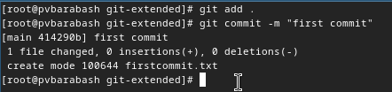
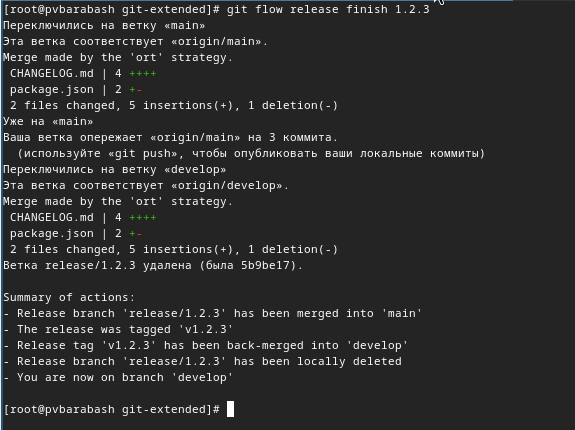

---
## Front matter
title: "Отчёт по лабораторной работе"
subtitle: "Лабораторная №4"
author: "Полина Витальевна Барабаш"

## Generic otions
lang: ru-RU
toc-title: "Содержание"

## Bibliography
bibliography: bib/cite.bib
csl: pandoc/csl/gost-r-7-0-5-2008-numeric.csl

## Pdf output format
toc: true # Table of contents
toc-depth: 2
lof: true # List of figures
lot: true # List of tables
fontsize: 12pt
linestretch: 1.5
papersize: a4
documentclass: scrreprt
## I18n polyglossia
polyglossia-lang:
  name: russian
  options:
	- spelling=modern
	- babelshorthands=true
polyglossia-otherlangs:
  name: english
## I18n babel
babel-lang: russian
babel-otherlangs: english
## Fonts
mainfont: PT Serif
romanfont: PT Serif
sansfont: PT Sans
monofont: PT Mono
mainfontoptions: Ligatures=TeX
romanfontoptions: Ligatures=TeX
sansfontoptions: Ligatures=TeX,Scale=MatchLowercase
monofontoptions: Scale=MatchLowercase,Scale=0.9
## Biblatex
biblatex: true
biblio-style: "gost-numeric"
biblatexoptions:
  - parentracker=true
  - backend=biber
  - hyperref=auto
  - language=auto
  - autolang=other*
  - citestyle=gost-numeric
## Pandoc-crossref LaTeX customization
figureTitle: "Рис."
tableTitle: "Таблица"
listingTitle: "Листинг"
lofTitle: "Список иллюстраций"
lotTitle: "Список таблиц"
lolTitle: "Листинги"
## Misc options
indent: true
header-includes:
  - \usepackage{indentfirst}
  - \usepackage{float} # keep figures where there are in the text
  - \floatplacement{figure}{H} # keep figures where there are in the text
---

# Цель работы

Целью данной работы является получение навыков правильной работы с репозиториями git [@tuis].

# Задание

Выполнить работу для тестового репозитория.

# Выполнение лабораторной работы

**Задание 1.** Установить git-flow.

Из режима суперпользователя я установила git-flow, сначала введя команду dnf copr enable elegos/gitflow (рис. [-@fig:001]), а затем dnf install gitflow (рис. [-@fig:002]).

{#fig:001 width=70%}

{#fig:002 width=70%}

**Задание 2.** Установить Node.js.

Я установила Node.js с помощью команды dnf install nodejs (рис. [-@fig:003]).

{#fig:003 width=70%}

Затем я установила pnpm с помощью команды dnf install pnpm (рис. [-@fig:004]).

{#fig:004 width=70%}

 
**Задание 3.** Настроить Node.js. 

Я выполненила команду настройки pnpm setup (рис. [-@fig:005]).

{#fig:005 width=70%}

А затем выполнила команду source ~/.bashrc, чтобы использовать pnpm (рис. [-@fig:006]).

{#fig:006 width=70%}

**Задание 4.** Настроить общепринятые коммиты.

Я добавила программу commitizen с помощью команды pnpm add -g commitizen (рис. [-@fig:007]).

{#fig:007 width=70%}

Я добавила программу standard-changelog с помощью команды pnpm add -g standard-changelog (рис. [-@fig:008]).

{#fig:008 width=70%}

**Задание 5.** Создать репозиторий git.

Я создала новый репозиторий на GitHub под названием git-extended и клонировала его в каталог git-extended своей виртуальной машины (рис. [-@fig:009]).

{#fig:009 width=70%}

**Задание 6.** Сделать первый коммит и выложить на github.

Я создала файл firstcommit.txt для того, чтобы были какие-то изменения в репозитории. Затем я выполнила команды git add . и  git commit -m "first commit" (рис. [-@fig:010]).

{#fig:010 width=70%}

Затем я выложила изменения на github с помощью команды git push -u origin main (рис. [-@fig:011]).

{#fig:011 width=70%}

**Задание 7.** Настроить конфигурацию общепринятых коммитов.

Сначала я инициализировала pnpm с помощью команды pnpm init. Затем открыла файл package.json в nano и изменила текст в соответствии с тем, что выложен на ТУИС (рис. [-@fig:012]).

{#fig:012 width=70%}

**Задание 8.** Добавить новые файлы, выполнить коммит и отправить на github.

Я добавила новые файлы с помощью команды "git add .". Выполнила коммит с помощью команды git cz и ответила на выпадающие вопросы (рис. [-@fig:013]).

{#fig:013 width=70%}

И затем отправила на github с помощью команды git push (рис. [-@fig:014]).

{#fig:014 width=70%}

**Задание 9.** Задать конфигурацию git-flow.

Я инициализировала git-flow с помощью команды git flow init, установив префикс для ярлыков в v (рис. [-@fig:015]).

{#fig:015 width=70%}

Я проверила, что нахожусь на ветке develop с помощью команды git branch (рис. [-@fig:016]).

{#fig:016 width=70%}

Я загрузила весь репозиторий в хранилище с помощью команды git push --all (рис. [-@fig:017]).

{#fig:017 width=70%}

Я установила внешнюю ветку как вышестоящую для этой ветки с помощью git branch --set-upstream-to=origin/develop develop (рис. [-@fig:018]).

{#fig:018 width=70%}

Я создала релиз с версией 1.0.0 с помощью git flow release start 1.0.0 (рис. [-@fig:019]).

{#fig:019 width=70%}

Я создала журнал изменений с помощью standard-changelog --first-release (рис. [-@fig:020]).

{#fig:020 width=70%}

Я добавила журнал изменений в индекс с помощью команд git add CHANGELOG.md и git commit -am 'chore(site): add changelog' (рис. [-@fig:021]).

{#fig:021 width=70%}

Я залила релизную ветку в основную ветку с помощью git flow release finish 1.0.0 (рис. [-@fig:022]).

{#fig:022 width=70%}

Я отправила данные на github с помощью команд git push --all и git push --tags (рис. [-@fig:023]).

{#fig:023 width=70%}

Я создала релиз на github. Для этого использовала утилиты работы с github: gh release create v1.0.0 -F CHANGELOG.md (рис. [-@fig:024]).

{#fig:024 width=70%}

Я создала ветку для новой функциональности с помощью команды git flow feature start feature_branch (рис. [-@fig:025]).

{#fig:025 width=70%}

Следующим шагом я объединила ветку feature_branch c develop с помощью git flow feature finish feature_branch (рис. [-@fig:026]).

{#fig:026 width=70%}

Я создала релиз с версией 1.2.3 с помощью команды git flow release start 1.2.3 (рис. [-@fig:027]).

{#fig:027 width=70%}

Я обновила номер версии в файле package.json: установила её в 1.2.3 (рис. [-@fig:028]).

{#fig:028 width=70%}

Я создала журнал изменений с помощью команды standard-changelog (рис. [-@fig:029]).

{#fig:029 width=70%}

Я добавила журнал изменений в индекс с помощью команд git add CHANGELOG.md и git commit -am 'chore(site): update changelog' (рис. [-@fig:030]).

{#fig:030 width=70%}

Я залила релизную ветку в основную ветку с помощью команды git flow release finish 1.2.3 (рис. [-@fig:031]).

{#fig:031 width=70%}

Я отправила данные на github с помощью команд git push --all и git push --tags (рис. [-@fig:032]).

{#fig:032 width=70%}

Я создала релиз на github с комментарием из журнала изменений с помощью команды gh release create v1.2.3 -F CHANGELOG.md (рис. [-@fig:033]).

{#fig:033 width=70%}

# Выводы

При выполнении данной лабораторной работы я получила навыки правильной работы с репозиториями git, настроила конфигурацию общепринятых коммитов.

# Список литературы{.unnumbered}

::: {#refs}
:::
