---
## Front matter
lang: ru-RU
title: Презентация лабораторной работы
subtitle: Лабораторная №5
author:
  - Барабаш П. В.
institute:
  - Российский университет дружбы народов, Москва, Россия
date: 12 марта 2024

## i18n babel
babel-lang: russian
babel-otherlangs: english

## Formatting pdf
toc: false
toc-title: Содержание
slide_level: 2
aspectratio: 169
section-titles: true
theme: metropolis
header-includes:
 - \metroset{progressbar=frametitle,sectionpage=progressbar,numbering=fraction}
 - '\makeatletter'
 - '\beamer@ignorenonframefalse'
 - '\makeatother'
 
 
## Fonts
mainfont: PT Serif
romanfont: PT Serif
sansfont: PT Sans
monofont: PT Mono
mainfontoptions: Ligatures=TeX
romanfontoptions: Ligatures=TeX
sansfontoptions: Ligatures=TeX,Scale=MatchLowercase
monofontoptions: Scale=MatchLowercase,Scale=0.9

---

## Докладчик

:::::::::::::: {.columns align=center}
::: {.column width="70%"}

  * Барабаш Полина Витальевна
  * студентка 1 курса, НПИбд-01-23
  * Российский университет дружбы народов
  * [1132231841@pfur.ru](mailto:1132231841@pfur.ru)

:::
::: {.column width="30%"}

:::
::::::::::::::

## Цели и задачи

Цель: настроить рабочую среду с использованием менеджера паролей pass

Задачи:

- Установить pass
- Инициализировать хранилище
- Синхронизироваться с git
- Настроить интерфейс с броузером
- Установить дополнительное программное обеспечение
- Создать и подключить репозиторий к системе
- Выполнить ежедневные операции c chezmoi
- Включение функции автоматического фиксирования и отправления изменений в исходный каталог в репозиторий

# Анализ и результаты выполнения лабораторной работы

## Установка pass

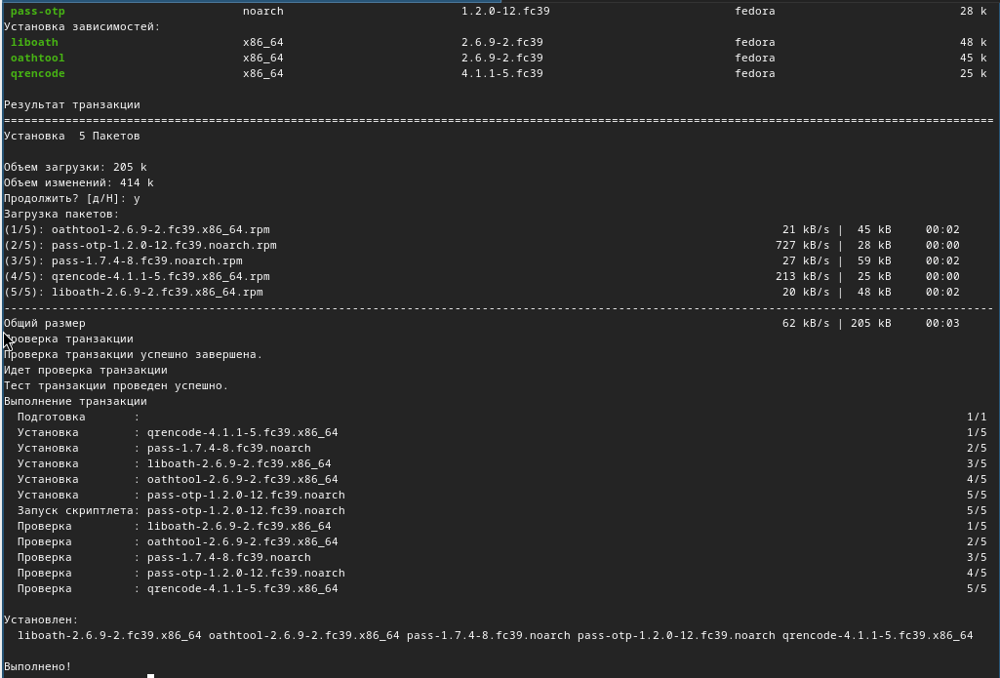

## Просмотр списка ключей GPG

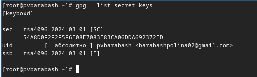

## Инициализация хранилища

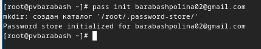

## Создание структуры git

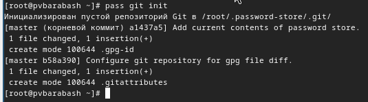

## Синхронизация адреса репозитория на хостинге

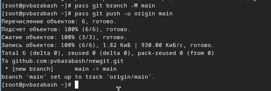

## Установка browserpass

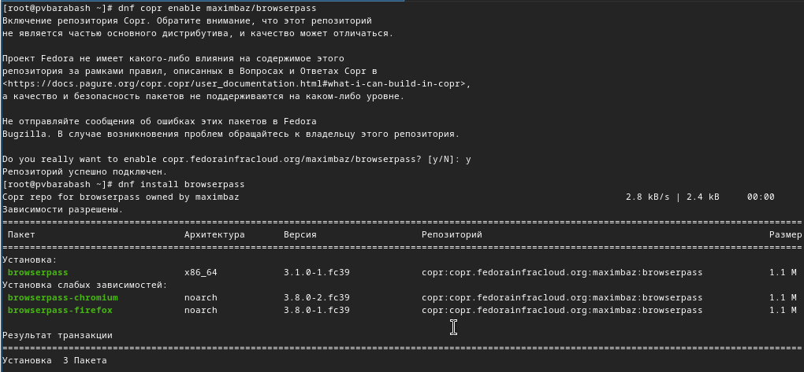

## Добавление, отображение и замена пароля

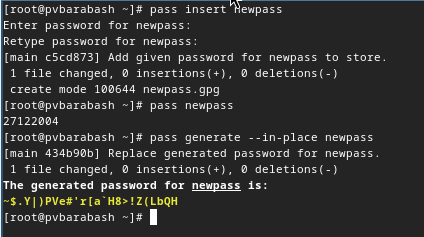

## Установка дополнительного программного обеспечения

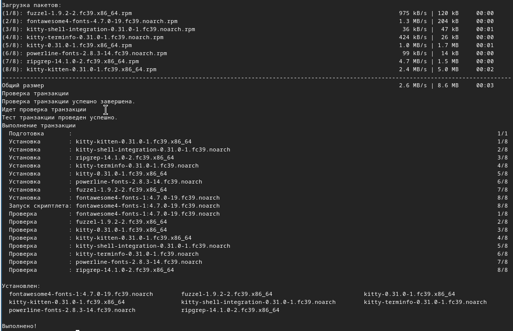

## Установка нужных шрифтов

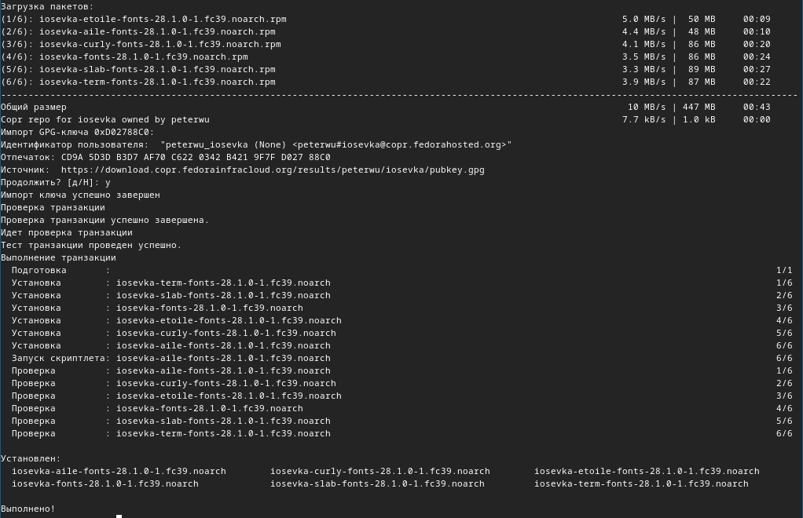

## Установка бинарного файла

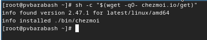

## Создание репозитория для конфигурационных файлов

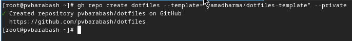

## Инициализация chezmoi с репозиторием dotfiles

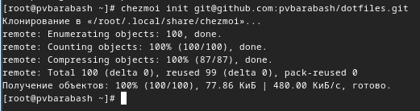

## Проверка изменений и их разрешение

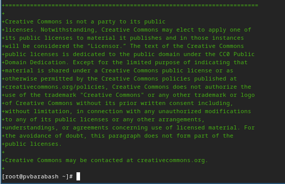

## Извлечение и применение изменений

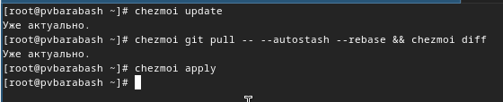

## Включение функции автоматического фиксирования и отправления изменений

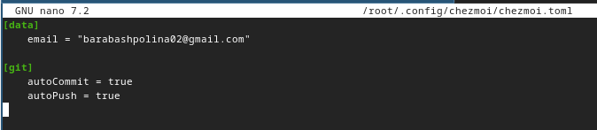

## Выводы

Мы научились настраивать рабочую среду с использованием менеджера паролей pass

