---
## Front matter
title: "Отчёт по лабораторной работе"
subtitle: "Лабораторная №5"
author: "Полина Витальевна Барабаш"

## Generic otions
lang: ru-RU
toc-title: "Содержание"

## Bibliography
bibliography: bib/cite.bib
csl: pandoc/csl/gost-r-7-0-5-2008-numeric.csl

## Pdf output format
toc: true # Table of contents
toc-depth: 2
lof: true # List of figures
lot: true # List of tables
fontsize: 12pt
linestretch: 1.5
papersize: a4
documentclass: scrreprt
## I18n polyglossia
polyglossia-lang:
  name: russian
  options:
	- spelling=modern
	- babelshorthands=true
polyglossia-otherlangs:
  name: english
## I18n babel
babel-lang: russian
babel-otherlangs: english
## Fonts
mainfont: PT Serif
romanfont: PT Serif
sansfont: PT Sans
monofont: PT Mono
mainfontoptions: Ligatures=TeX
romanfontoptions: Ligatures=TeX
sansfontoptions: Ligatures=TeX,Scale=MatchLowercase
monofontoptions: Scale=MatchLowercase,Scale=0.9
## Biblatex
biblatex: true
biblio-style: "gost-numeric"
biblatexoptions:
  - parentracker=true
  - backend=biber
  - hyperref=auto
  - language=auto
  - autolang=other*
  - citestyle=gost-numeric
## Pandoc-crossref LaTeX customization
figureTitle: "Рис."
tableTitle: "Таблица"
listingTitle: "Листинг"
lofTitle: "Список иллюстраций"
lotTitle: "Список таблиц"
lolTitle: "Листинги"
## Misc options
indent: true
header-includes:
  - \usepackage{indentfirst}
  - \usepackage{float} # keep figures where there are in the text
  - \floatplacement{figure}{H} # keep figures where there are in the text
---

# Цель работы

Целью данной работы является настройка рабочей среды с использованием менеджера паролей pass [@tuis].

# Задание

Настроить рабочую среду с использованием pass.

# Выполнение лабораторной работы

**Задание 1.** Установить pass.

Из режима суперпользователя я установила pass с помощью команды dnf install pass pass-otp (рис. [-@fig:001]).

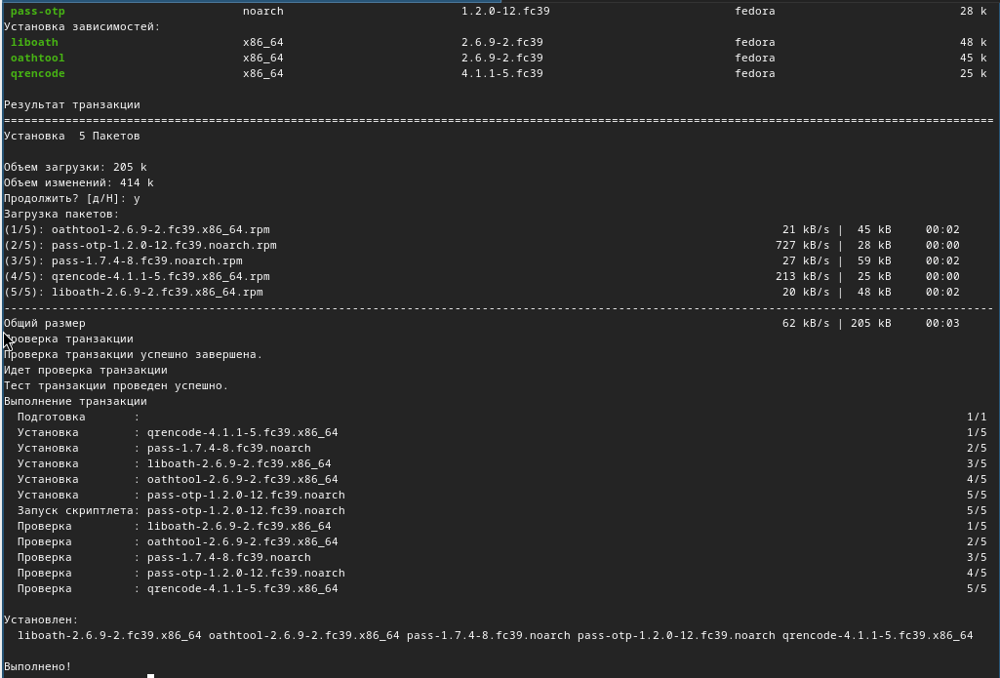{#fig:001 width=70%}

**Задание 2.** Посмотреть список ключей GPG.

Я выполнила просмотр ключей gpg с помощью команды gpg --list-secret-keys и увидела, что созданные ключи имеются (рис. [-@fig:002]).

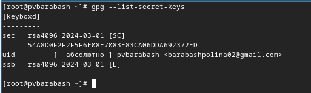{#fig:002 width=70%}

 
**Задание 3.** Инициализировать хранилище. 

Я инициализировала хранилище с помощью команды pass init barabashpolina02@gmail.com (рис. [-@fig:003]).

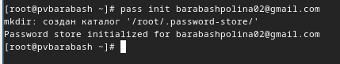{#fig:003 width=70%}

**Задание 4.** Синхронизироваться с git.

Я создала структуру git с помощью команды pass git init (рис. [-@fig:004]).

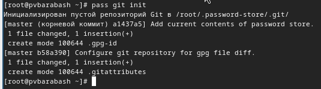{#fig:004 width=70%}

Затем я задала адрес репозитория на хостинге, предварительно создав репозиторий с помощью команды pass git remote add origin git@github.com:<git_username>/<git_repo>.git, введя свой ник в github и имя созданного репозитория. Для синхронизации я выполнила следующие команды: pass git branch -M main и pass git push -u origin main  (рис. [-@fig:005]).

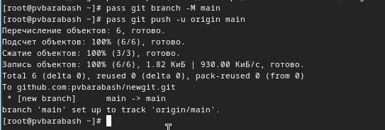{#fig:005 width=70%}

**Задание 5.** Настроить интерфейс с броузером.

Я скачала броузер с помощью команд dnf copr enable maximbaz/browserpass и dnf install browserpass (рис. [-@fig:006]).

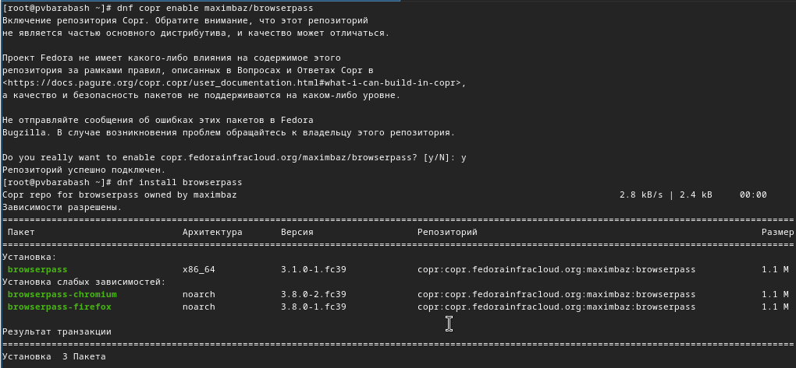{#fig:006 width=70%}

**Задание 6.** Сохранить пароль.

Я добавила новый пароль в файл newpass с помощью команды pass insert newpass, затем отобразила пароль для указанного имени файла с помощью команды pass newpass и заменила существующий пароль с помощью команды pass generate --in-place newpass (рис. [-@fig:007]).

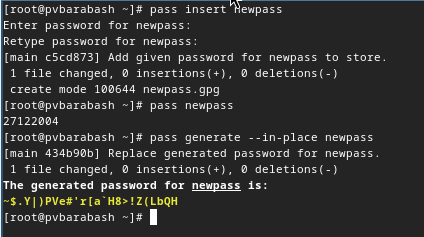{#fig:007 width=70%}

**Задание 7.** Установить дополнительное программное обеспечение.

Я установила дополнительное программное обеспечение (рис. [-@fig:008]).

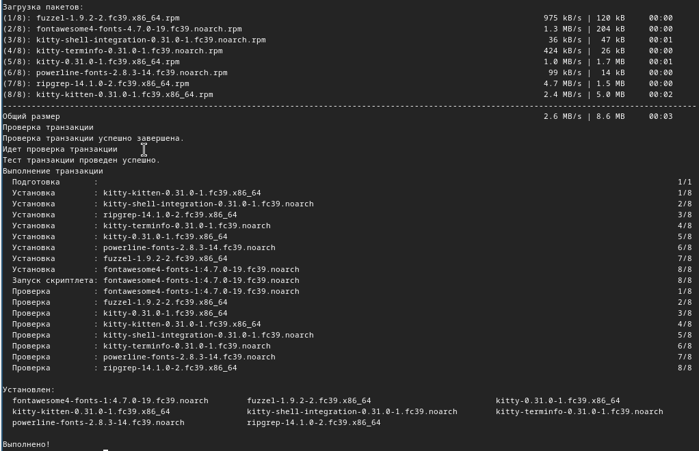{#fig:008 width=70%}

Затем я установила нужные шрифты (рис. [-@fig:009]).

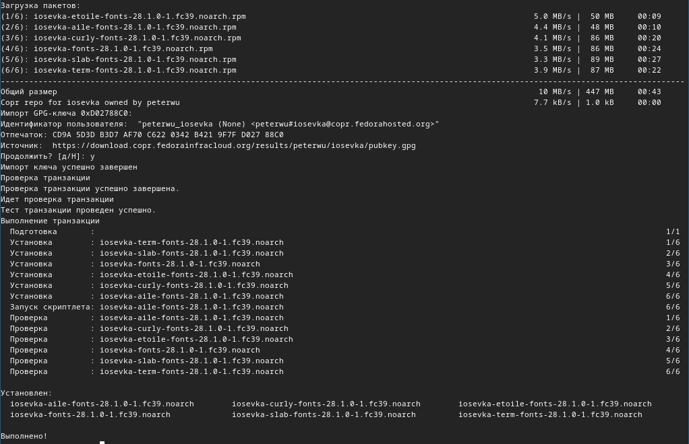{#fig:009 width=70%}

**Задание 8.** Установить бинарный файл.

Я установила бинарный файл с помощью wget (рис. [-@fig:010]).

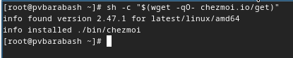{#fig:010 width=70%}

**Задание 9.** Создать собственный репозиторий с помощью утилит.

Я создала свой репозиторий для конфигурационных файлов на основе шаблона (рис. [-@fig:011]).

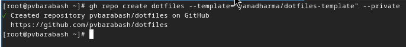{#fig:011 width=70%}

**Задание 10.** Подключить репозиторий к своей системе.

Я инициализировала chezmoi с моим репозиторием dotfiles (рис. [-@fig:012]).

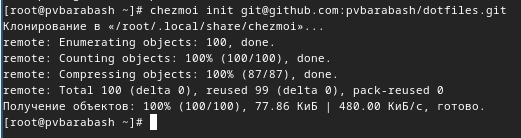{#fig:012 width=70%}

Я проверила, какие изменения внесёт chezmoi в домашний каталог и запустила команду chezmoi apply -v (рис. [-@fig:013]).

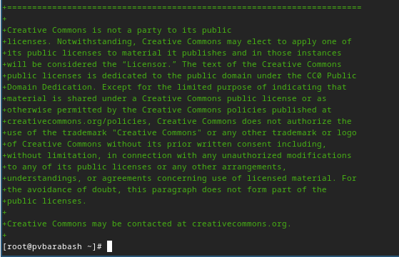{#fig:013 width=70%}

**Задание 11.** Выполнить ежедневные операции c chezmoi. 

Я извлекла последние изменения из репозитория и применила их с помощью chezmoi update, chezmoi git pull -- --autostash --rebase && chezmoi diff и приняла их с помощью chezmoi apply (рис. [-@fig:014]).

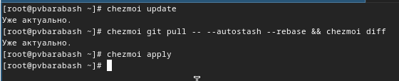{#fig:014 width=70%}

**Задание 12.** Включение функции автоматического фиксирования и отправления изменений в исходный каталог в репозиторий.

Я открыла файл ~/.config/chezmoi/chezmoi.toml с помощью nano и включила функцию, введя нужные строки (рис. [-@fig:015]).

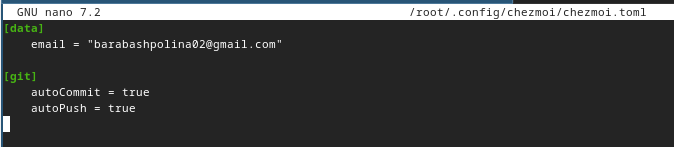{#fig:015 width=70%}

# Выводы

При выполнении данной лабораторной работы я получила навыки работы с pass и настроила рабочую среду.

# Список литературы{.unnumbered}

::: {#refs}
:::
