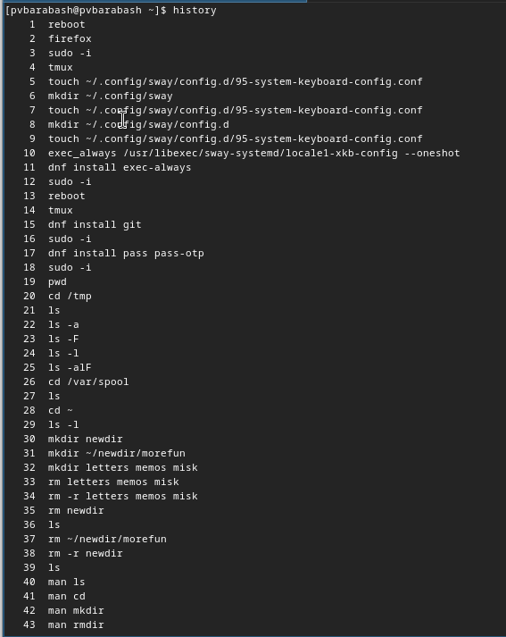

---
## Front matter
title: "Отчёт по лабораторной работе"
subtitle: "Лабораторная №6"
author: "Полина Витальевна Барабаш"

## Generic otions
lang: ru-RU
toc-title: "Содержание"

## Bibliography
bibliography: bib/cite.bib
csl: pandoc/csl/gost-r-7-0-5-2008-numeric.csl

## Pdf output format
toc: true # Table of contents
toc-depth: 2
lof: true # List of figures
lot: true # List of tables
fontsize: 12pt
linestretch: 1.5
papersize: a4
documentclass: scrreprt
## I18n polyglossia
polyglossia-lang:
  name: russian
  options:
	- spelling=modern
	- babelshorthands=true
polyglossia-otherlangs:
  name: english
## I18n babel
babel-lang: russian
babel-otherlangs: english
## Fonts
mainfont: PT Serif
romanfont: PT Serif
sansfont: PT Sans
monofont: PT Mono
mainfontoptions: Ligatures=TeX
romanfontoptions: Ligatures=TeX
sansfontoptions: Ligatures=TeX,Scale=MatchLowercase
monofontoptions: Scale=MatchLowercase,Scale=0.9
## Biblatex
biblatex: true
biblio-style: "gost-numeric"
biblatexoptions:
  - parentracker=true
  - backend=biber
  - hyperref=auto
  - language=auto
  - autolang=other*
  - citestyle=gost-numeric
## Pandoc-crossref LaTeX customization
figureTitle: "Рис."
tableTitle: "Таблица"
listingTitle: "Листинг"
lofTitle: "Список иллюстраций"
lotTitle: "Список таблиц"
lolTitle: "Листинги"
## Misc options
indent: true
header-includes:
  - \usepackage{indentfirst}
  - \usepackage{float} # keep figures where there are in the text
  - \floatplacement{figure}{H} # keep figures where there are in the text
---

# Цель работы

Целью данной работы является приобретение практических навыков взаимодействия пользователя с системой посредством командной строки [@tuis].

# Задание

- Совершить взаимодействие с системой посредством команд в командной строке.

# Выполнение лабораторной работы

**Задание 1.** Определить полное имя домашнего каталога.

Я определила полное имя моего домашнего каталога с помощью команды pwd (рис. [-@fig:001]).

{#fig:001 width=70%}

**Задание 2.** Перейти в каталог /tmp.

Я перешла в каталог /tmp с помощью команды cd (рис. [-@fig:002]).

{#fig:002 width=70%}

 
**Задание 3.** Вывести на экран содержимое каталога /tmp. Для этого использовать команду ls с различными опциями. Пояснить разницу в выводимой на экран информации. 

Сначала я вывела содержимое каталога с помощью команды ls без опций, мы получили список файлов, которые в нем хранятся. Затем я использовала опцию -a и в результате в список также попали скрытые файлы (рис. [-@fig:003]).

{#fig:003 width=70%}

Затем я использовала команду ls с опцией -F, благодаря этой опции мы получаем тип файла, в каталоге /tmp лежат только каталоги (знак "/" после имени) (рис. [-@fig:004]).

{#fig:004 width=70%}

Затем я использовала команду ls с опцией -l (рис. [-@fig:005]), мы получили подробную информацию о каждом файле, в которую входит:

- тип файла,

- право доступа,

- число ссылок,

- владелец,

- размер,

- дата последней ревизии,

- имя файла или каталога [@tuis].

{#fig:005 width=70%}

Также я использовала все три до этого используемых операции и вывела всю информацию сразу (рис. [-@fig:006]).

{#fig:006 width=70%} 

**Задание 4.** Определить, есть ли в каталоге /var/spool подкаталог с именем cron?

Я перешла в каталог /var/spool с помощью cd и вывела на экран список файлов с помощью ls. Действительно, подкаталог с именем cron имеется в /var/spool (рис. [-@fig:007]).

{#fig:007 width=70%}

**Задание 5.** Перейти в домашний каталог и вывести на экран его содержимое. Определить, кто является владельцем файлов и подкаталогов.

Я перешла в домашний каталог с помощью команды cd ~ и вывела на экран содержимое с помощью команды ls, используя опцию -l, чтобы получить информацию о владельце (рис. [-@fig:008]).

{#fig:008 width=70%}

**Задание 6.** В домашнем каталоге создайте новый каталог с именем newdir. В каталоге ~/newdir создайте новый каталог с именем morefun. В домашнем каталоге создайте одной командой три новых каталога с именами letters, memos, misk. Затем удалите эти каталоги одной командой.Попробуйте удалить ранее созданный каталог ~/newdir командой rm. Проверьте, был ли каталог удалён. Удалите каталог ~/newdir/morefun из домашнего каталога. Проверьте, был ли каталог удалён.

Я создала в домашнем каталоге каталог с именем newdir с помощью команды mkdir. Затем я в каталоге ~/newdir создала новый каталог с именем morefun. В домашнем каталоге создала одной командой три новых каталога с именами letters, memos, misk. Затем я удалила эти каталоги одной командой. Попробовала удалить ранее созданный каталог ~/newdir командой rm. Получила ошибку, что это каталог, его нельзя удалить просто командой rm. Я проверила, был ли каталог удалён. Он не был удален. Затем я попробовала удалить каталог ~/newdir/morefun из домашнего каталога. Проверила, был ли каталог удалён. Не был по той же причине. Затем я удалила каталоги newdir и morefun с помощью опции -r команды rm. Проверила, что каталоги действительно были удалены (рис. [-@fig:009]).

{#fig:009 width=70%}

**Задание 7.** С помощью команды man определите, какую опцию команды ls нужно использовать для просмотра содержимого не только указанного каталога, но и подкаталогов, входящих в него.

Я вывела информацию по команде ls с помощью команды man и нашла, что для просмотра содержимого не только указанного каталога, но и подкаталогов необходимо использовать опцию -R или --recursive (рис. [-@fig:010]).

{#fig:010 width=70%}\

**Задание 8.** С помощью команды man определите набор опций команды ls, позволяющий отсортировать по времени последнего изменения выводимый список содержимого каталога с развёрнутым описанием файлов.

Для того, чтобы вывести список содержимого каталога с развернутым описанием файлов необходимо использовать опцию -l, это мы уже знаем. Следовательно, нужно найти также опцию, которая будет сортировать по времени изменения файла, это опция -t (рис. [-@fig:011]).

{#fig:011 width=70%}

**Задание 9.** Используйте команду man для просмотра описания следующих команд: cd, pwd, mkdir, rmdir, rm. Поясните основные опции этих команд

С помощью команды man я посмотрела описания приведенных команд.

Команды cd (рис. [-@fig:012]). Она используется для перехода в нужный каталог. Путь может быть задан абсолютно или относительно.

{#fig:012 width=70%}

Команды pwd (рис. [-@fig:013]). Она используется, чтобы определить абсолютный путь к текущему каталогу.

{#fig:013 width=70%}

Команды mkdir (рис. [-@fig:014]). Она используется для создания нового каталога.

{#fig:014 width=70%}

Команды rmdir (рис. [-@fig:015]). Она используется для удаления пустого каталога. 

{#fig:015 width=70%}

Команды rm (рис. [-@fig:016]). Она используется для удаления файлов и/или каталогов. 

{#fig:016 width=70%}

**Задание 10.** Используя информацию, полученную при помощи команды history, выполните модификацию и исполнение нескольких команд из буфера команд.

Я выполнила команду history и получила пронумерованную историю команд (рис. [-@fig:017]).

{#fig:017 width=70%}

Я использовала несколько команд из буфера команд, обращаясь к ним по номеру с помощью "!" (рис. [-@fig:018]).

{#fig:018 width=70%}

# Ответы на контрольные вопросы

1. Что такое командная строка?

**Командная строка (или терминал, или консоль)** — способ взаимодействия между человеком и компьютером путём отправки компьютеру команд.

2. При помощи какой команды можно определить абсолютный путь текущего каталога? Приведите пример.

Определить абсолютный путь текущего каталога можно с помощью команды pwd. Например, команда pwd, вызванная в домашнем каталоге, для меня покажет /home/pvbarabash.

3. При помощи какой команды и каких опций можно определить только тип файлов и их имена в текущем каталоге? Приведите примеры.

При помощью команды ls с опцией -F. Пример представлен на (рис. [-@fig:004]).

4. Каким образом отобразить информацию о скрытых файлах? Приведите примеры.

При помощью команды ls с опцией -a. Пример представлен на (рис. [-@fig:003]).

5. При помощи каких команд можно удалить файл и каталог? Можно ли это сделать одной и той же командой? Приведите примеры.

И файл и каталог можно удалить командой rm, однако для удаления каталога потребуется опция -r. Пример представлен на (рис. [-@fig:009]).

6. Каким образом можно вывести информацию о последних выполненных пользователем командах?

Вывести информацию о последних выполненных пользователем командах можно с помощью команды history.

7. Как воспользоваться историей команд для их модифицированного выполнения? Приведите примеры.

Можно модифицировать команду из выведенного на экран списка при помощи следующей конструкции: 

!<номер_команды>:s/<что_меняем>/<на_что_меняем>

Примером может служить команда !3:s/a/F, где третьей командо является ls -a, а мы меняем опцию на F.

8. Приведите примеры запуска нескольких команд в одной строке.
Если требуется выполнить последовательно несколько команд, записанный в одной строке, то для этого используется символ точка с запятой. Пример cd; ls

9. Дайте определение и приведите примера символов экранирования.

**Экранирование символов** — замена в тексте управляющих (служебных) символов на соответствующие им последовательности символов. Например, символ "\" сообщает интерпретатору, что следующий за ним символ должен восприниматься как обычный символ.

10. Охарактеризуйте вывод информации на экран после выполнения команды ls с опцией l.

При использовании опции -l при команде ls мы получаем подробную информацию о содержащихся файлах, в которую входит:

- тип файла,

- право доступа,

- число ссылок,

- владелец,

- размер,

- дата последней ревизии,

- имя файла или каталога [@tuis].

11. Что такое относительный путь к файлу? Приведите примеры использования относительного и абсолютного пути при выполнении какой-либо команды.

**Относительный путь** — путь по отношению к текущему рабочему каталогу пользователя. Например, находясь в домашнем каталоге и желая открыть каталог newdir мы можем использовать относительный путь: cd mkdir, а может использовать абсолютный путь: cd /home/pvbarabash/mkdir.

12. Как получить информацию об интересующей вас команде?

Чтобы получить информацию об интересующей команде нужно ввести man и команду, которая интересует.

13. Какая клавиша или комбинация клавиш служит для автоматического дополнения вводимых команд?

Клавиша Tab.

# Выводы

При выполнении данной лабораторной работы я приобрела практические навыки взаимодействия пользователя с системой посредством командной строки.

# Список литературы{.unnumbered}

::: {#refs}
:::
