---
## Front matter
title: "Отчёт по лабораторной работе"
subtitle: "Лабораторная №8"
author: "Полина Витальевна Барабаш"

## Generic otions
lang: ru-RU
toc-title: "Содержание"

## Bibliography
bibliography: bib/cite.bib
csl: pandoc/csl/gost-r-7-0-5-2008-numeric.csl

## Pdf output format
toc: true # Table of contents
toc-depth: 2
lof: true # List of figures
lot: true # List of tables
fontsize: 12pt
linestretch: 1.5
papersize: a4
documentclass: scrreprt
## I18n polyglossia
polyglossia-lang:
  name: russian
  options:
	- spelling=modern
	- babelshorthands=true
polyglossia-otherlangs:
  name: english
## I18n babel
babel-lang: russian
babel-otherlangs: english
## Fonts
mainfont: PT Serif
romanfont: PT Serif
sansfont: PT Sans
monofont: PT Mono
mainfontoptions: Ligatures=TeX
romanfontoptions: Ligatures=TeX
sansfontoptions: Ligatures=TeX,Scale=MatchLowercase
monofontoptions: Scale=MatchLowercase,Scale=0.9
## Biblatex
biblatex: true
biblio-style: "gost-numeric"
biblatexoptions:
  - parentracker=true
  - backend=biber
  - hyperref=auto
  - language=auto
  - autolang=other*
  - citestyle=gost-numeric
## Pandoc-crossref LaTeX customization
figureTitle: "Рис."
tableTitle: "Таблица"
listingTitle: "Листинг"
lofTitle: "Список иллюстраций"
lotTitle: "Список таблиц"
lolTitle: "Листинги"
## Misc options
indent: true
header-includes:
  - \usepackage{indentfirst}
  - \usepackage{float} # keep figures where there are in the text
  - \floatplacement{figure}{H} # keep figures where there are in the text
---

# Цель работы

Ознакомление с инструментами поиска файлов и фильтрации текстовых данных. Приобретение практических навыков: по управлению процессами (и заданиями), по проверке использования диска и обслуживанию файловых систем [@tuis].

# Выполнение лабораторной работы

**Задание 1.** Запишите в файл file.txt названия файлов, содержащихся в каталоге /etc. Допишите в этот же файл названия файлов, содержащихся в вашем домашнем каталоге.

Я записала в фалй file.txt названия файлов, содержащихся в каталоге /etc с помощью команды ls и перенаправления вывода >. Затем, также с помощью команды ls и перенаправления вывода, но уже используя >>, я дозаписала названия файлов в домашней директории (рис. [-@fig:001]).

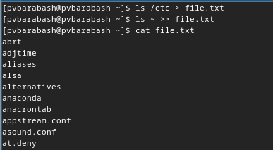{#fig:001 width=70%}

**Задание 2.** Выведите имена всех файлов из file.txt, имеющих расширение .conf, после чего запишите их в новый текстовой файл conf.txt.

Я вывела имена всех файлов из file.txt, имеющих расширение .conf, с помощью команды grep (рис. [-@fig:002]).

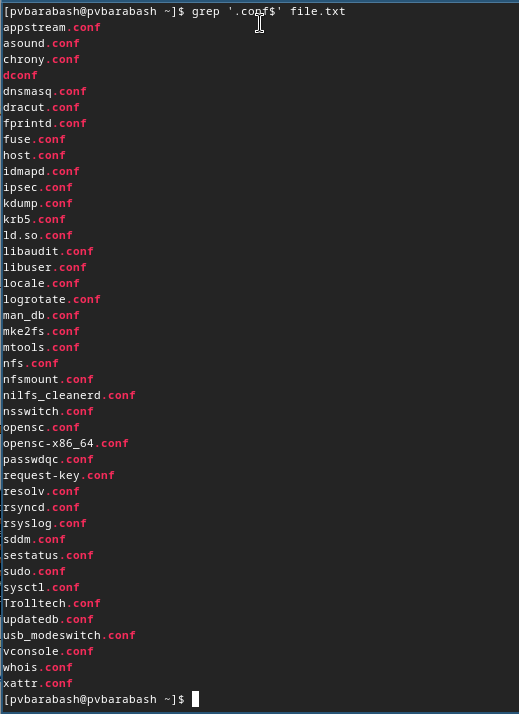{#fig:002 width=70%}

Затем я перенаправила вывод вместо терминала в файл conf.txt с помощью > (рис. [-@fig:003]).

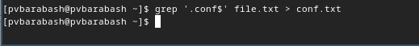{#fig:003 width=70%}

 
**Задание 3.** Определите, какие файлы в вашем домашнем каталоге имеют имена, начинавшиеся с символа c? Предложите несколько вариантов, как это сделать.

Я определила, какие файлы в домашнем каталоге имеют имена, начинавшиеся с символа 'c' с помощью команды find (рис. [-@fig:004]).

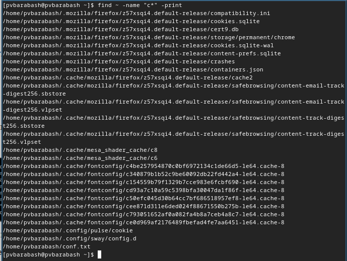{#fig:004 width=70%}

Другой вариант: использовать конвейер и команды ls и grep (рис. [-@fig:005]).

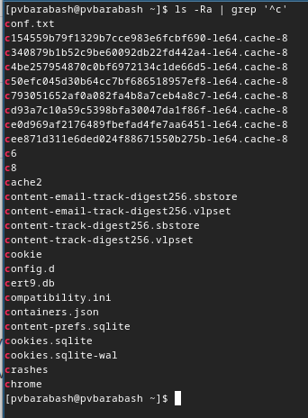{#fig:005 width=70%}

**Задание 4.** Выведите на экран (по странично) имена файлов из каталога /etc, начинающиеся с символа h.

Для вывода на экран по странично имен файлов из каталога /etc, начинающиеся с символа h, я использовала конвейер и команды ls и less (рис. [-@fig:006]).

{#fig:006 width=70%} 

**Задание 5.** Запустите в фоновом режиме процесс, который будет записывать в файл ~/logfile файлы, имена которых начинаются с log.

Я запустила в фоновом режиме процесс, который будет записывать в файл ~/logfile файлы, имена которых начинаются с log, с помощью конвейера, поиска по маске с помощью find и значка амперсанта & (рис. [-@fig:007]).

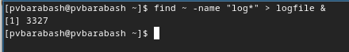{#fig:007 width=70%}

**Задание 6.** Удалите файл ~/logfile.

С помощью команды rm я удалила файл ~/logfile (рис. [-@fig:008]).

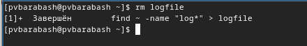{#fig:008 width=70%}

**Задание 7.** Запустите из консоли в фоновом режиме редактор gedit.

Я попробовала запустить gedit в фоновом режиме с помощью амперсанта в конце, однако получила предупреждение о невозможности открыть на дисплее (рис. [-@fig:009]).

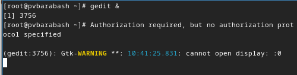{#fig:009 width=70%}

**Задание 8.** Определите идентификатор процесса gedit, используя команду ps, конвейер и фильтр grep. Как ещё можно определить идентификатор процесса?

Я попрообовала использовать ps для вывода номера процесса, но он завершается (рис. [-@fig:010]).

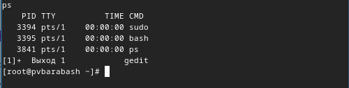{#fig:010 width=70%}

Затем я использовала конвейер и фильтр grep, результат такой же. Также можно использовать команды jobs.

**Задание 9.** Выполните команды df и du, предварительно получив более подробную информацию об этих командах, с помощью команды man.

Я прочитала подробнее о командах df и du, а затем выполнила их (рис. [-@fig:011]) и (рис. [-@fig:012]).

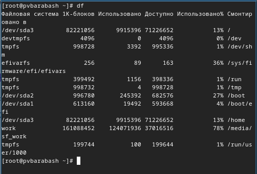{#fig:011 width=70%}

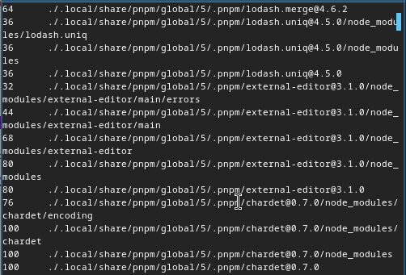{#fig:012 width=70%}

**Задание 10.** Воспользовавшись справкой команды find, выведите имена всех директорий, имеющихся в вашем домашнем каталоге.

Я почитала справку о команде find с помощью man и узнала, что для вывода имен именно директорий нужно использовать -type d (рис. [-@fig:013]). 

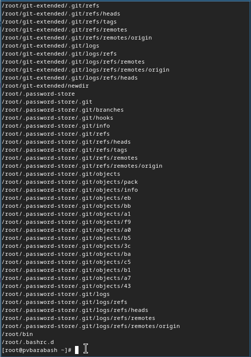{#fig:013 width=70%}

# Ответы на контрольные вопросы

1. Какие потоки ввода вывода вы знаете?

В системе по умолчанию открыто три специальных потока:

- stdin — стандартный поток ввода (по умолчанию: клавиатура), файловый дескриптор 0;
- stdout — стандартный поток вывода (по умолчанию: консоль), файловый дескриптор 1;
- stderr — стандартный поток вывод сообщений об ошибках (по умолчанию: консоль), файловый дескриптор 2.

2. Объясните разницу между операцией > и >>.

С помощью операции > мы перенаправляем вывод в новый файл, если в нем есть уже записи, то он будет перезаписан. Операция >> же дозаписывает в файл перенаправленный вывод.

3. Что такое конвейер?

Возможность последовательно выполнять команды, каждая последующая использует на вход вывод предыдущей.

4. Что такое процесс? Чем это понятие отличается от программы?

Процесс — это программа во время её исполнения, со всеми её данными и потребляемыми ресурсами процессора. Программа же это набор команд для выполнения.

5. Что такое PID и GID?

PID — это идентификационный номер процесса. 

GID — это идентификационный номер группы данного процесса.

6. Что такое задачи и какая команда позволяет ими управлять?

Запущенные фоном программы называются задачами. Ими можно управлять с помощью команды jobs, которая выводит список запущенных в данный момент задач.

7. Найдите информацию об утилитах top и htop. Каковы их функции?

top — интерактивный просмотрщик процессов. htop — аналог top.

8. Назовите и дайте характеристику команде поиска файлов. Приведите примеры использования этой команды.

Для поиска файлов используется команда find. С помощью неё можно искать файл по имени, по дате созданию, по владельцу и так далее. Например, команда find ~ -name "h*" -print найдет все файлы с именем, начинающимся на h и выведет их на экран.

9. Можно ли по контексту (содержанию) найти файл? Если да, то как?

Можно, для этого нужно использовать команду grep и поиск по каталогам.

# Выводы

Я ознакомилась с инструментами поиска файлов и фильтрации текстовых данных, приобрела практические навыки по управлению процессами (и заданиями), по проверке использования диска и обслуживанию файловых систем.

# Список литературы{.unnumbered}

::: {#refs}
:::
