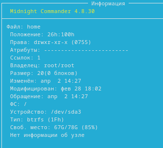
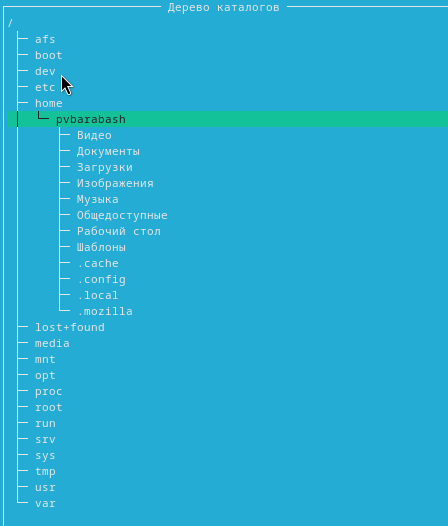
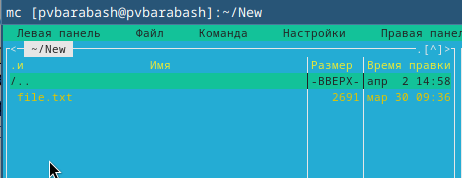
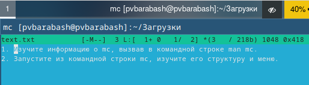

---
## Front matter
title: "Отчёт по лабораторной работе"
subtitle: "Лабораторная №9"
author: "Полина Витальевна Барабаш"

## Generic otions
lang: ru-RU
toc-title: "Содержание"

## Bibliography
bibliography: bib/cite.bib
csl: pandoc/csl/gost-r-7-0-5-2008-numeric.csl

## Pdf output format
toc: true # Table of contents
toc-depth: 2
lof: true # List of figures
lot: true # List of tables
fontsize: 12pt
linestretch: 1.5
papersize: a4
documentclass: scrreprt
## I18n polyglossia
polyglossia-lang:
  name: russian
  options:
	- spelling=modern
	- babelshorthands=true
polyglossia-otherlangs:
  name: english
## I18n babel
babel-lang: russian
babel-otherlangs: english
## Fonts
mainfont: PT Serif
romanfont: PT Serif
sansfont: PT Sans
monofont: PT Mono
mainfontoptions: Ligatures=TeX
romanfontoptions: Ligatures=TeX
sansfontoptions: Ligatures=TeX,Scale=MatchLowercase
monofontoptions: Scale=MatchLowercase,Scale=0.9
## Biblatex
biblatex: true
biblio-style: "gost-numeric"
biblatexoptions:
  - parentracker=true
  - backend=biber
  - hyperref=auto
  - language=auto
  - autolang=other*
  - citestyle=gost-numeric
## Pandoc-crossref LaTeX customization
figureTitle: "Рис."
tableTitle: "Таблица"
listingTitle: "Листинг"
lofTitle: "Список иллюстраций"
lotTitle: "Список таблиц"
lolTitle: "Листинги"
## Misc options
indent: true
header-includes:
  - \usepackage{indentfirst}
  - \usepackage{float} # keep figures where there are in the text
  - \floatplacement{figure}{H} # keep figures where there are in the text
---

# Цель работы

Освоение основных возможностей командной оболочки Midnight Commander. Приобретение навыков практической работы по просмотру каталогов и файлов; манипуляций с ними [@tuis].

# Выполнение лабораторной работы

**Задание 1.** Изучите информацию о mc, вызвав в командной строке man mc.

Я выполнила команду man mc и изучила информацию о Midnight Commander (рис. [-@fig:001]).

{#fig:001 width=70%}

**Задание 2.** Запустите из командной строки mc, изучите его структуру и меню.

Я запустила из командой строки mc, набрав mc и нажав Enter. Затем я изучила структуру и меню (рис. [-@fig:002]).

{#fig:002 width=70%}

 
**Задание 3.** Выполните несколько операций в mc, используя управляющие клавиши (операции с панелями; выделение/отмена выделения файлов, копирование/перемещение файлов, получение информации о размере и правах доступа на файлы и/или каталоги и т.п.)

С помощью F9 я переключилась на меню над панелями (рис. [-@fig:003]).

{#fig:003 width=70%}

С помощью F5 я скопировала файл (рис. [-@fig:004]).

{#fig:004 width=70%}

С помощью F6 я переместила файл (рис. [-@fig:005]).

{#fig:005 width=70%}

С помощью комбинации клавиш ctrl+x c я посмотрела информацию о правах доступа на файл (рис. [-@fig:006]).

{#fig:006 width=70%}

**Задание 4.** Выполните основные команды меню левой (или правой) панели. Оцените степень подробности вывода информации о файлах.

Я выбрала в меню "левая панель" и команду "информация", получив подробную информацию о файле, в которую входила информация о времени создания, времени изменения, правах, размере, местонахождении и ещё некоторая информация, то есть информация представлена подробно  (рис. [-@fig:007]).

{#fig:007 width=70%}

Затем я нажала на "дерево" и получила древовидную структуру каталогов (рис. [-@fig:008]).

{#fig:008 width=70%}

**Задание 5.** Используя возможности подменю Файл, выполните: просмотр содержимого текстового файла; редактирование содержимого текстового файла (без сохранения результатов редактирования); создание каталога; копирование файлов в созданный каталог.

Используя возможности подменю Файлы, я просмотрела содержимое текстового файла (рис. [-@fig:009]).

{#fig:009 width=70%}

Затем я открыла файл для редактирования и изменила его (рис. [-@fig:010]).

{#fig:010 width=70%}

После этого я создала новый каталог New (рис. [-@fig:011]) 

{#fig:011 width=70%}

И затем я скопировала текстовый файл в созданный каталог (рис. [-@fig:012]).

{#fig:012 width=70%}

**Задание 6.** С помощью соответствующих средств подменю Команда осуществите: поиск в файловой системе файла с заданными условиями (например, файла с расширением .c или .cpp, содержащего строку main).

Я осуществила поиск в файловой системе файла с расширением .txt и словом anaconda (рис. [-@fig:013]). 

{#fig:013 width=70%}

**Задание 7.** Вызовите подменю Настройки. Освойте операции, определяющие структуру экрана mc (Full screen, Double Width, Show Hidden Files и т.д.)

Я вызвала подменю Настройки и освоила операции, определяющие структуру экрана mc (рис. [-@fig:014]). 

{#fig:014 width=70%}

**Задание 8.** Создайте текстовой файл text.txt.

Я создала текстовый файл text.txt (рис. [-@fig:015]). 

{#fig:015 width=70%}

**Задание 9.** Откройте этот файл с помощью встроенного в mc редактора. Вставьте в открытый файл небольшой фрагмент текста, скопированный из любого другого файла или Интернета.

Я открыла файл text.txt и вставила в него небольшой скопированный текст (рис. [-@fig:016]). 

{#fig:016 width=70%}

**Задание 10.** Проделайте с текстом следующие манипуляции, используя горячие клавиши:

1. Удалите строку текста.

2. Выделите фрагмент текста и скопируйте его на новую строку.

3. Выделите фрагмент текста и перенесите его на новую строку.

4. Сохраните файл.

5. Перейдите в конец файла (нажав комбинацию клавиш) и напишите некоторый
текст.

6. Перейдите в начало файла (нажав комбинацию клавиш) и напишите некоторый
текст.

7. Сохраните и закройте файл.

Я удалила строку текста с помощью Ctrl-y (рис. [-@fig:017]). 

{#fig:017 width=70%}

Я выделила фрагмент текста с помощью F3 и скопировала его на новую строку с помощью F5 (рис. [-@fig:018]). 

{#fig:018 width=70%}

Я переместила выбранный фрагмент на новую строку с помощью F6 (рис. [-@fig:019]). 

{#fig:019 width=70%}

Я сохранила изменения с помощью F2 (рис. [-@fig:020]). 

{#fig:020 width=70%}

Я переместилась в конец файла с помощью клавиши end и дописала текст (рис. [-@fig:021]). 

{#fig:021 width=70%}

Я переместилась в начало с помощью клавиши home и дописала текст (рис. [-@fig:022]). 

{#fig:022 width=70%}

Я нажала клавишу F10, чтобы выйти из редактора и сохранила изменения (рис. [-@fig:023]). 

{#fig:023 width=70%}

# Выводы

Я освоила основные возможности командной оболочки Midnight Commander, приобрела навыки практической работы по просмотру каталогов и файлов, манипуляций с ними.

# Список литературы{.unnumbered}

::: {#refs}
:::
