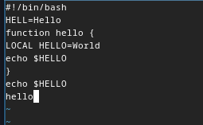
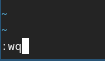
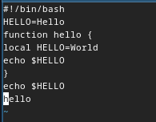
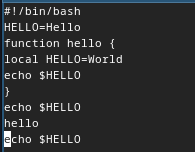

---
## Front matter
title: "Отчёт по лабораторной работе"
subtitle: "Лабораторная №10"
author: "Полина Витальевна Барабаш"

## Generic otions
lang: ru-RU
toc-title: "Содержание"

## Bibliography
bibliography: bib/cite.bib
csl: pandoc/csl/gost-r-7-0-5-2008-numeric.csl

## Pdf output format
toc: true # Table of contents
toc-depth: 2
lof: true # List of figures
lot: true # List of tables
fontsize: 12pt
linestretch: 1.5
papersize: a4
documentclass: scrreprt
## I18n polyglossia
polyglossia-lang:
  name: russian
  options:
	- spelling=modern
	- babelshorthands=true
polyglossia-otherlangs:
  name: english
## I18n babel
babel-lang: russian
babel-otherlangs: english
## Fonts
mainfont: PT Serif
romanfont: PT Serif
sansfont: PT Sans
monofont: PT Mono
mainfontoptions: Ligatures=TeX
romanfontoptions: Ligatures=TeX
sansfontoptions: Ligatures=TeX,Scale=MatchLowercase
monofontoptions: Scale=MatchLowercase,Scale=0.9
## Biblatex
biblatex: true
biblio-style: "gost-numeric"
biblatexoptions:
  - parentracker=true
  - backend=biber
  - hyperref=auto
  - language=auto
  - autolang=other*
  - citestyle=gost-numeric
## Pandoc-crossref LaTeX customization
figureTitle: "Рис."
tableTitle: "Таблица"
listingTitle: "Листинг"
lofTitle: "Список иллюстраций"
lotTitle: "Список таблиц"
lolTitle: "Листинги"
## Misc options
indent: true
header-includes:
  - \usepackage{indentfirst}
  - \usepackage{float} # keep figures where there are in the text
  - \floatplacement{figure}{H} # keep figures where there are in the text
---

# Цель работы

Познакомиться с операционной системой Linux. Получить практические навыки работы с редактором vi, установленным по умолчанию практически во всех дистрибутивах. [@tuis].

# Выполнение лабораторной работы

**Задание 1.** Создайте каталог с именем ~/work/os/lab06.

Я создала каталог с именем ~/work/os/lab06, используя команду mkdir и опцию -p (рис. [-@fig:001]).

{#fig:001 width=70%}

**Задание 2.** Перейдите во вновь созданный каталог.

Я перешла во вновь созданный каталог с помощью команды cd (рис. [-@fig:002]).

{#fig:002 width=70%}

 
**Задание 3.** Вызовите vi и создайте файл hello.sh

Для вызова и создания файла я ввела команду vi hello.sh (рис. [-@fig:003]).

{#fig:003 width=70%}

Так как такого файла не существовало, он создался.

**Задание 4.** Нажмите клавишу i и введите данный текст.

С помощью клавиши i я перешла в режим редактирования и вставила скопированный текст из лабораторной работы (рис. [-@fig:004]).

{#fig:004 width=70%}

**Задание 5.** Нажмите клавишу Esc для перехода в командный режим после завершения ввода текста. Нажмите : для перехода в режим последней строки и внизу вашего экрана появится приглашение в виде двоеточия. Нажмите w (записать) и q (выйти), а затем нажмите клавишу Enter для сохранения вашего текста и завершения работы.

Я вышла из режима редактирования с помощью клавиши Esc, затем нажала : и ввела wq, для того, чтобы выйти из редактора с сохранением (рис. [-@fig:005]).

{#fig:005 width=70%}

**Задание 6.** Сделайте файл исполняемым.

С помощью команды chmod +x hello.sh я сделала файл исполняемым (рис. [-@fig:006]).

{#fig:006 width=70%}

**Задание 7.** Вызовите vi на редактирование файла. 

С помощью команды vi ~/work/os/lab06/hello.sh я вызвала vi на редактирование файла  (рис. [-@fig:007]).

{#fig:007 width=70%}

**Задание 8.** Установите курсор в конец слова HELL второй строки.

Я установила курсор в конец слова HELL второй строки (рис. [-@fig:008]).

{#fig:008 width=70%}

**Задание 9.** Перейдите в режим вставки и замените на HELLO. Нажмите Esc для возврата в командный режим.

Я нажала клавишу i и перешла в режим редактирования и добавила к HELL O (рис. [-@fig:009]).

{#fig:009 width=70%}

Затем я нажала Esc.

**Задание 10.** Установите курсор на четвертую строку и сотрите слово LOCAL.

Я установила курсор на четвертую строку, нажала dw и удалила слово LOCAL (рис. [-@fig:010]).

{#fig:010 width=70%}

**Задание 11.** Перейдите в режим вставки и наберите следующий текст: local, нажмите Esc для возврата в командный режим.

Я перешла в режим вставки (с помощью i) и набрала local (рис. [-@fig:011]) 

{#fig:011 width=70%}

Затем нажала Esc для возврата в командный режим.

**Задание 12.** Установите курсор на последней строке файла. Вставьте после неё строку, содержащую следующий текст: echo $HELLO.

Я установила курсор на последней строке файла и вставила после неё строку echo $HELLO (рис. [-@fig:012]).

{#fig:012 width=70%}

**Задание 13.** Удалите последнюю строку.

Я удалила последнюю строку с помощью dd (рис. [-@fig:013]). 

{#fig:013 width=70%}

**Задание 14.** Введите команду отмены изменений u для отмены последней команды.

Я ввела команду отмены изменений u и строка вернулась обратно (рис. [-@fig:014]). 

{#fig:014 width=70%}

**Задание 15.** Введите символ : для перехода в режим последней строки. Запишите произведённые изменения и выйдите из vi.

Я опять повторила действия для выхода с сохранением: нажала :, затем wq и вышла из vi (рис. [-@fig:015]). 

{#fig:015 width=70%}

# Выводы

Я познакомилась с операционной системой Linux и получила практические навыки работы с редактором vi, установленным по умолчанию практически во всех дистрибутивах.

# Список литературы{.unnumbered}

::: {#refs}
:::
