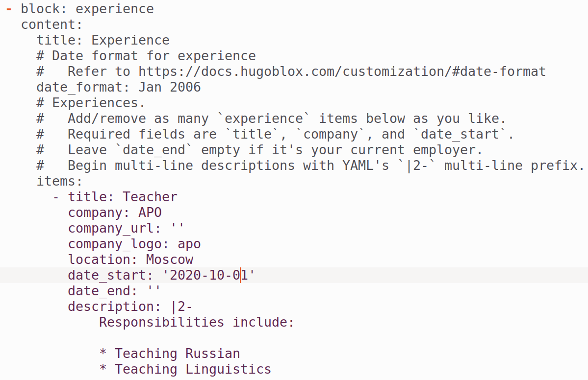

---
## Front matter
title: "Отчёт по индивидуальному проекту"
subtitle: "Этап 3"
author: "Полина Витальевна Барабаш"

## Generic otions
lang: ru-RU
toc-title: "Содержание"

## Bibliography
bibliography: bib/cite.bib
csl: pandoc/csl/gost-r-7-0-5-2008-numeric.csl

## Pdf output format
toc: true # Table of contents
toc-depth: 2
lof: true # List of figures
lot: true # List of tables
fontsize: 12pt
linestretch: 1.5
papersize: a4
documentclass: scrreprt
## I18n polyglossia
polyglossia-lang:
  name: russian
  options:
	- spelling=modern
	- babelshorthands=true
polyglossia-otherlangs:
  name: english
## I18n babel
babel-lang: russian
babel-otherlangs: english
## Fonts
mainfont: PT Serif
romanfont: PT Serif
sansfont: PT Sans
monofont: PT Mono
mainfontoptions: Ligatures=TeX
romanfontoptions: Ligatures=TeX
sansfontoptions: Ligatures=TeX,Scale=MatchLowercase
monofontoptions: Scale=MatchLowercase,Scale=0.9
## Biblatex
biblatex: true
biblio-style: "gost-numeric"
biblatexoptions:
  - parentracker=true
  - backend=biber
  - hyperref=auto
  - language=auto
  - autolang=other*
  - citestyle=gost-numeric
## Pandoc-crossref LaTeX customization
figureTitle: "Рис."
tableTitle: "Таблица"
listingTitle: "Листинг"
lofTitle: "Список иллюстраций"
lotTitle: "Список таблиц"
lolTitle: "Листинги"
## Misc options
indent: true
header-includes:
  - \usepackage{indentfirst}
  - \usepackage{float} # keep figures where there are in the text
  - \floatplacement{figure}{H} # keep figures where there are in the text
---

# Цель работы

Целью данного этапа работы является размещение на Github pages данных о навыках, опыте и достижениях, а также создание двух постов [@tuis].

# Выполнение работы

**Задание 1.** Добавить информацию о навыках (Skills).

Для того, чтобы добавить информацию о навыках, я перешла в каталог content, затем в authors и наконец в admin, где находится файл _index.md. Именно в нем есть часть кода, которая отвечает за размещение навыков. Я добавила информацию о технических навыках, выбрав степень их владения в процентном соотношении (рис. [-@fig:001]).

{#fig:001 width=70%}

Затем ниже я таким же образом добавила информацию о хобби (рис. [-@fig:002]).

{#fig:002 width=70%}

**Задание 2.** Добавить информацию об опыте (Experience).

Чтобы добавить информацию об опыте, а также достижениях, нужно перейти в другой Markdown-файл, который находится в каталоге content и называется _index.md. Там я добавила одно место работы, так как опыта ещё не так много (рис. [-@fig:003]).

{#fig:003 width=70%}

**Задание 3.** Добавить информацию о достижениях (Accomplishments).

Как уже было сказано, информация о достижениях находится в том же файле, что и информация об опыте. Я добавила один релевантный полностью пройденный курс, оставила ссылку на сертификат (рис. [-@fig:004]).

{#fig:004 width=70%}

**Задание 4.** Сделать пост по прошедшей неделе.

В каталоге content/post я создала каталог week25-31, в котором создала файл index.md и добавила картинки, которые планировала использовать в посте (рис. [-@fig:005]).

{#fig:005 width=70%}

Я освежила в памяти рекомендации по написанию поста по прошедшей неделе [@shablon]. И принялась писать пост.

Так как текст пишется в формате маркдаун, то для написания поста мне пригодились знания о разметке, полученные в течении прошлого и этого семестров. 

Я написала пост и с помощью команд git add ., git commit ... и git push обновила удаленный репозиторий.

**Задание 5.** Добавить пост на тему по выбору.

Я выбрала тему Легковесные языки разметки, так как мне было интересно побольше узнать о них, ведь в курсе мы познакомились с языком разметки Markdown. Я изучила различный материал в целом о языках разметки, об особенностях легковесных, а также о некоторых конкретных легковесных языках разметки. Выбирала я их, исходя из своих соображений о возможности столкновения с ними. 

Как и для поста по прошедшей недели, я создала новый каталог всё в том же каталоге post и добавила туда картинки и файл index.md (рис. [-@fig:006]).

{#fig:006 width=70%}

Привожу ссылки на некоторые материалы в сети, которыми я пользовалась [@pop; @markup; @markdown].

Оба поста были выложены на сайт (рис. [-@fig:007]).

{#fig:007 width=70%}

# Выводы

При выполнении данного этапа индивидуального проекта я приобрела практические навыки добавления информации о навыках, опыте и достижениях на сайт и навыки написания постов на сайт.

# Список литературы{.unnumbered}

::: {#refs}
:::

