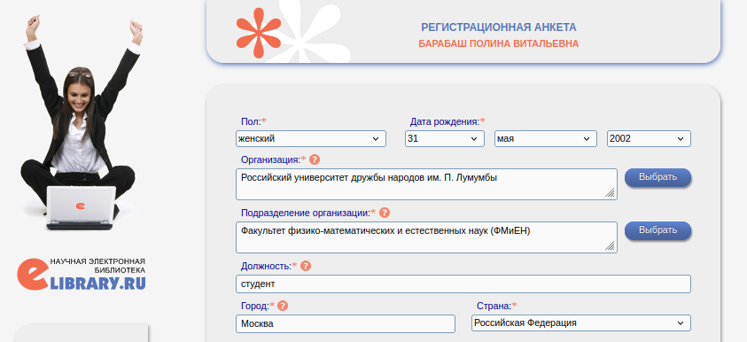
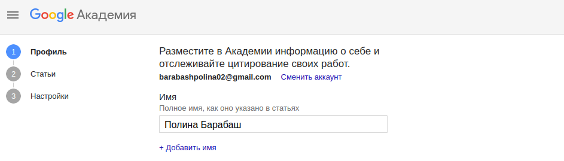
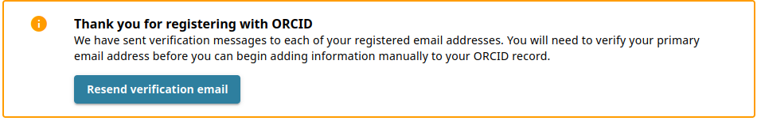
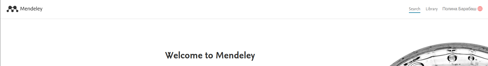
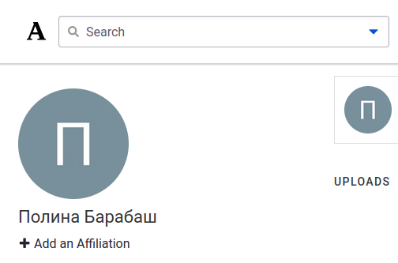
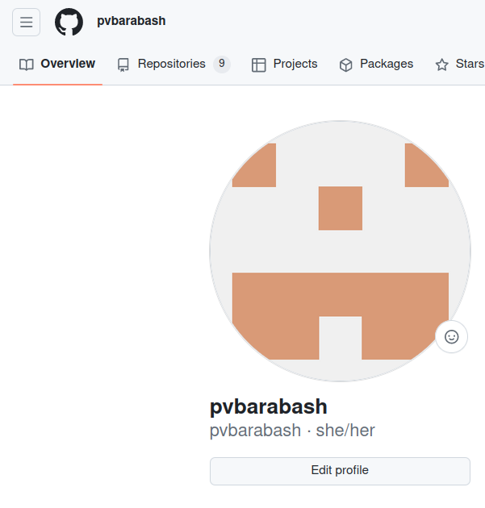
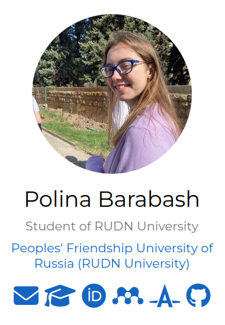
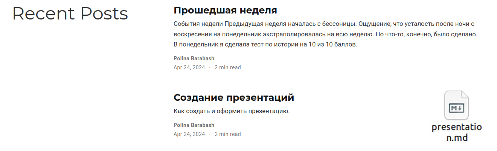

---
## Front matter
title: "Отчёт по индивидуальному проекту"
subtitle: "Этап 4"
author: "Полина Витальевна Барабаш"

## Generic otions
lang: ru-RU
toc-title: "Содержание"

## Bibliography
bibliography: bib/cite.bib
csl: pandoc/csl/gost-r-7-0-5-2008-numeric.csl

## Pdf output format
toc: true # Table of contents
toc-depth: 2
lof: true # List of figures
lot: true # List of tables
fontsize: 12pt
linestretch: 1.5
papersize: a4
documentclass: scrreprt
## I18n polyglossia
polyglossia-lang:
  name: russian
  options:
	- spelling=modern
	- babelshorthands=true
polyglossia-otherlangs:
  name: english
## I18n babel
babel-lang: russian
babel-otherlangs: english
## Fonts
mainfont: PT Serif
romanfont: PT Serif
sansfont: PT Sans
monofont: PT Mono
mainfontoptions: Ligatures=TeX
romanfontoptions: Ligatures=TeX
sansfontoptions: Ligatures=TeX,Scale=MatchLowercase
monofontoptions: Scale=MatchLowercase,Scale=0.9
## Biblatex
biblatex: true
biblio-style: "gost-numeric"
biblatexoptions:
  - parentracker=true
  - backend=biber
  - hyperref=auto
  - language=auto
  - autolang=other*
  - citestyle=gost-numeric
## Pandoc-crossref LaTeX customization
figureTitle: "Рис."
tableTitle: "Таблица"
listingTitle: "Листинг"
lofTitle: "Список иллюстраций"
lotTitle: "Список таблиц"
lolTitle: "Листинги"
## Misc options
indent: true
header-includes:
  - \usepackage{indentfirst}
  - \usepackage{float} # keep figures where there are in the text
  - \floatplacement{figure}{H} # keep figures where there are in the text
---

# Цель работы

Целью данного этапа работы является добавление к сайту ссылок на научные и библиометрические ресурсы, написание поста по прошедшей неделе и по выбранной теме [@tuis].

# Выполнение работы

**Задание 1.** Зарегистрироваться на соответствующих ресурсах и разместить на них ссылки на сайте.

Я зарегистрировалась почти на всех представленных ресурсах, на некоторых возникли проблемы с прихождением писем подтверждений на почту или проблемы при регистрации. Подтверждения регистраций:

eLibrary (рис. [-@fig:001]).

{#fig:001 width=70%}

Google Scholar (рис. [-@fig:002]).

{#fig:002 width=70%}

ORCID (рис. [-@fig:003]).

{#fig:003 width=70%}

Mendeley (рис. [-@fig:004]).

{#fig:004 width=70%}

Academia.edu (рис. [-@fig:005]).

{#fig:005 width=70%}

github (рис. [-@fig:006]).

{#fig:006 width=70%}

Затем я добавила все нужные ссылки в файл _index.md, находящийся в папке content/authors/admin. 
Информация появилась на сайте (рис. [-@fig:007]).

{#fig:007 width=70%}

**Задание 4.** Сделать пост по прошедшей неделе.

В каталоге content/post я создала каталог week15-21, в котором создала файл index.md и добавила картинки, которые планировала использовать в посте 

Я освежила в памяти рекомендации по написанию поста по прошедшей неделе [@shablon]. И принялась писать пост.

Я написала пост и с помощью команд git add ., git commit ... и git push обновила удаленный репозиторий.

**Задание 5.** Добавить пост на тему по выбору.

Я выбрала тему Создание презентаций. Как и для поста по прошедшей недели, я создала новый каталог всё в том же каталоге post и добавила туда картинки и файл index.md. Написала пост.

Оба поста были выложены на сайт (рис. [-@fig:008]).

{#fig:008 width=70%}

# Выводы

При выполнении данного этапа индивидуального проекта я приобрела практические навыки к сайту ссылок на научные и библиометрические ресурсы, написание постов.

# Список литературы{.unnumbered}

::: {#refs}
:::

