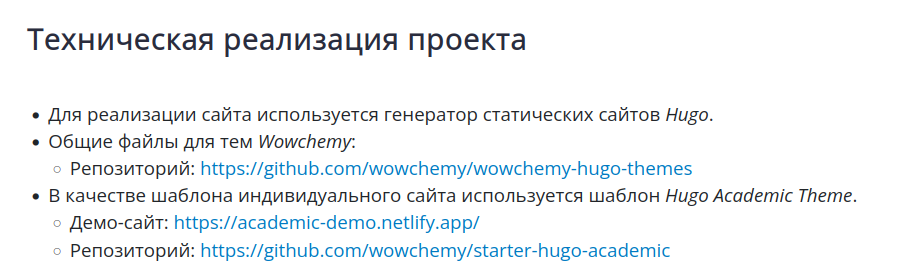
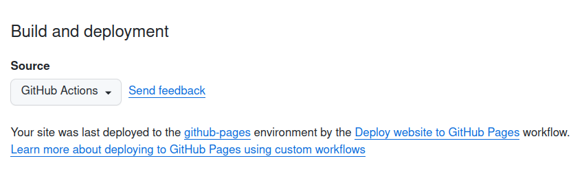

---
## Front matter
title: "Отчёт по индивидуальному проекту"
subtitle: "Этап 1"
author: "Полина Витальевна Барабаш"

## Generic otions
lang: ru-RU
toc-title: "Содержание"

## Pdf output format
toc: true # Table of contents
toc-depth: 2
lof: true # List of figures
fontsize: 12pt
linestretch: 1.5
papersize: a4
documentclass: scrreprt
## I18n polyglossia
polyglossia-lang:
  name: russian
  options:
	- spelling=modern
	- babelshorthands=true
polyglossia-otherlangs:
  name: english
## I18n babel
babel-lang: russian
babel-otherlangs: english
## Fonts
mainfont: PT Serif
romanfont: PT Serif
sansfont: PT Sans
monofont: PT Mono
mainfontoptions: Ligatures=TeX
romanfontoptions: Ligatures=TeX
sansfontoptions: Ligatures=TeX,Scale=MatchLowercase
monofontoptions: Scale=MatchLowercase,Scale=0.9
## Biblatex
biblatex: true
biblio-style: "gost-numeric"
biblatexoptions:
  - parentracker=true
  - backend=biber
  - hyperref=auto
  - language=auto
  - autolang=other*
  - citestyle=gost-numeric
## Pandoc-crossref LaTeX customization
figureTitle: "Рис."
listingTitle: "Листинг"
lofTitle: "Список иллюстраций"
lolTitle: "Листинги"
## Misc options
indent: true
header-includes:
  - \usepackage{indentfirst}
  - \usepackage{float} # keep figures where there are in the text
  - \floatplacement{figure}{H} # keep figures where there are in the text
---
# Цель работы

Целью данного этапа работы является размещение на Github pages заготовки для персонального сайта.

# Выполнение работы

Задание 1. Установить необходимое программное обеспечение.

Необходимым программным обеспечением является установка Git на компьютер. У меня уже был он установлен (рис. [-@fig:001]).

{#fig:001 width=70%}

Задание 2. Скачать шаблон темы сайта.

Я перешла по ссылке на страницу в ТУИС, которая называется "Техническая реализация проекта" (рис. [-@fig:002]).

{#fig:002 width=70%}

Затем я перешла по ссылке шаблона сайта, который мы будем использовать — Hugo Academic Theme. И нажала на get started. На открывшейся странице я нашла нужный шаблон (рис. [-@fig:003]).

{#fig:003 width=70%}

Задание 3. Разместить шаблон темы сайта на хостинге git.

Нажав на edit, я создала новый репозиторий, назвав его site (рис. [-@fig:004]).

{#fig:004 width=70%}

Задание 4. Разместить заготовку сайта на Github pages.

Перейдя в настройки, я выбрала кнопку Pages, где источником выбрала GitHub Actions (рис. [-@fig:005]).

{#fig:005 width=70%}

Затем я перешла в Actions, выбрала кнопку Deploy website to GitHub Pages и нажала Run workflow. После этого сайт был создан и выше появилась поле Deploy website to GitHub Pages с галочкой слева (рис. [-@fig:006]).

{#fig:006 width=70%}

Я перешла по данной ссылке и увидела ссылку на созданный сайт. Перешла по ней и проверила корректность сайта (рис. [-@fig:007]).

{#fig:007 width=70%}

После этого я также добавила ссылку на сайт в репозиторий (рис. [-@fig:008]).

{#fig:008 width=70%}

# Выводы

При выполнении данного этапа индивидуального проекта я приобрела практические навыки создания сайта по шаблону на GitHub Pages.
